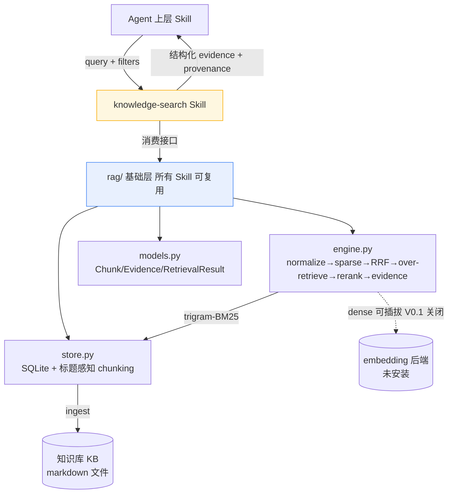

# Knowledge Search（Skill 4）— 验收报告

> 实现依据：用户提供的 Skill 4 Codex 设计 Prompt（35 节）+ 架构决策
> 「`rag/` 基础层 + 轻量 Skill 包裹」「后端：稀疏优先 FTS5（零额外依赖，现在可跑）」。
> 验收日期：2026-09-13。环境：Python 3.13 托管 venv（仅 stdlib + jsonschema）。

---

## 一、验收清单（spec §34）

| # | 验收项 | 结果 | 说明 |
|---|--------|------|------|
| 1 | 独立可验证检索 Skill，不生成面向客户答案 | ✅ | `CONTRACT.md` 明确边界；引擎零 LLM 调用 |
| 2 | 遵循 Lawgent RAG 思路（hybrid→over-retrieve→rerank→provenance） | ✅ | `rag/engine.py`：normalize→sparse→RRF→over-retrieval→rerank→evidence |
| 3 | Hybrid retrieval 骨架（dense 可插拔，V0.1 仅稀疏） | ✅ | `DenseRetriever(enabled=dense_enabled)`，`dense_enabled:false` |
| 4 | Over-retrieval（candidate_k > final_k） | ✅ | `candidate_k=20, final_k=5`，`over_retrieval_factor=4` |
| 5 | Rerank 加权（语义/关键词/领域/来源/特异性） | ✅ | 权重外置 `ranking.rules.json`，引擎只读 |
| 6 | 来源等级 S/A/B/C/D 映射与优先级 | ✅ | `source_quality` 外置；`_case_source_priority` PASS |
| 7 | 状态四态 success/partial/insufficient/retrieval_error | ✅ | `q_nonexistent` → `insufficient_evidence` |
| 8 | 部分证据 partial_evidence | ✅ | 阈值 `partial_threshold` 外置 |
| 9 | 来源冲突 conflict（保留双方证据，不合并） | ✅ | `_case_conflict` PASS（`conflict=true`，30天/90天并存） |
| 10 | 结构化 provenance 输出（chunk_id/文档/章节/内容/分） | ✅ | `Evidence` 含全部溯源字段 |
| 11 | 目录结构符合项目架构（SKILL.md≤100行 + references/schemas/evals/resources/scripts/tmp） | ✅ | SKILL.md 50 行；确定性规则外置 |
| 12 | 上游不可变（不改 client-intake/requirement_analysis/risk-analysis） | ✅ | 仅新增 `rag/` + `knowledge-search/` 目录，零修改既有 Skill |
| 13 | 成为可复用基础能力层（非「一个 Skill 调另一个 Skill」） | ✅ | 检索在仓库根 `rag/`，Skill 仅消费接口 |
| 14 | Eval 七维全 PASS（Recall/Precision/Ranking/Source/Abstention/Conflict/Metadata filter） | ✅ | 见第三节 |
| 15 | 输入/输出 schema 校验（draft-07） | ✅ | 负例 `INPUT_INVALID`、正例通过；CLI 内置 `validate_output` |
| 16 | 失败/边界处理（无可靠知识→insufficient，绝不 LLM 自补） | ✅ | `abstention` 用例；引擎无生成分支 |

---

## 二、最终输出（spec §35）

### 1. Files changed（全部为新增，未改动既有 Skill）

**共享基础层 `rag/`（仓库根，所有 Skill 可复用）**
- `rag/__init__.py` — 包入口（导出 models/store/engine）
- `rag/models.py` — `Chunk / NormalizedQuery / Candidate / Evidence / RetrievalResult`（dataclass + `to_dict`）
- `rag/store.py` — `KnowledgeStore`（SQLite 内存库）、`chunk_markdown()`（H1/H2/H3 标题感知切分）、`ingest_file/ingest_dir/filtered_chunks`
- `rag/engine.py` — `normalize_query` / `SparseRetriever`(trigram-BM25) / `DenseRetriever`(占位) / `rrf_fuse` / `DefaultReranker`(权重外置) / `KnowledgeSearchEngine.search`

**Skill 包裹 `.trae/skills/knowledge-search/`**
- `SKILL.md`（≤100 行 manifest）
- `CONTRACT.md` — 边界与上游不可变声明
- `references/01-retrieval-policy.md`、`02-source-policy.md`、`03-ranking-policy.md`
- `resources/usage-guide.md`
- `resources/config/retrieval.rules.json`（`candidate_k/min_relevance/rrf_k/dense_enabled/over_retrieval_factor`）
- `resources/config/ranking.rules.json`（`weights / source_quality / partial_threshold / conflict_keys`）
- `schemas/knowledge-search-input.schema.json`、`knowledge-search-output.schema.json`（draft-07）
- `evals/eval-policy.md`、`evals/cases/dataset-manifest.json`（4 自然用例，单一真源）
- `evals/fixtures/kb/01_medical_insurance.md` … `06_claims.md`（6 份标记 TEST DATA 的最小 KB）
- `scripts/invoke-knowledge-search.py`（CLI+可导入 API，内置输出校验）
- `scripts/validate_retrieval.py`（`validate_input` / `validate_output`）
- `scripts/run_knowledge_search_dataset.py`（全量 Eval 回归，8 用例）
- `scripts/test-knowledge-search.py`（单测包装，`pytest` 非必需）

### 2. Architecture（Mermaid）



### 3. Retrieval example（CLI 实跑输出节选）

```bash
python scripts/invoke-knowledge-search.py --query "百万医疗险和重疾险有什么区别？" --top-k 3
```

```json
{
  "status": "success",
  "normalized_query": "百万医疗险和重疾险有什么区别",
  "results": [
    { "chunk_id": "02_critical_illness_003", "section": "3. 与百万医疗险区别",
      "content": "重疾险与百万医疗险区别明显：重疾险给付型、医疗险报销型；前者保\"病\"达到状态即赔，后者保\"费\"凭票据报销。",
      "score": 0.7825, "source_level": "B" },
    { "chunk_id": "01_medical_insurance_003", "section": "3. 与重疾险区别",
      "content": "百万医疗险与重疾险的赔付逻辑不同：前者报销医疗费用，后者达到约定重大疾病状态即给付约定金额。两者可互补，不冲突。",
      "score": 0.7807, "source_level": "B" }
  ],
  "conflict": false,
  "retrieval_metadata": { "candidate_count": 10, "returned_count": 2,
                           "retrieval_method": "sparse_rrf", "reranker": "default",
                           "candidate_chunk_ids": ["02_critical_illness_003","01_medical_insurance_003", ...] }
}
```

### 4. Eval results（8 用例全绿）

| 用例 | 维度 | 结果 | 关键断言 |
|------|------|------|----------|
| q_medical_vs_critical | Recall+Ranking | ✅ | 医疗/重疾区别两段均进候选且命中 top |
| q_waiting_period | Recall | ✅ | 30天/90天等待期两段均召回 |
| q_preexisting | Recall | ✅ | 既往症 + 理赔中既往症两段召回 |
| q_nonexistent | Abstention | ✅ | 石墨烯电池 → `insufficient_evidence`，0 结果 |
| conflict_detection | Conflict | ✅ | `conflict=true`，保留 30天 与 90天 双方 |
| source_priority | Source | ✅ | S 级排序先于 D 级 |
| metadata_filter | Metadata filter | ✅ | `product_type=medical` 仅返医疗段 |
| abstention | Abstention | ✅ | 空库查询 → `insufficient_evidence`，不编造 |

> 运行：`python scripts/run_knowledge_search_dataset.py` 与 `python scripts/test-knowledge-search.py` 均输出 `ALL GREEN`（exit 0）。

### 5. Known limitations（V0.1）

1. **仅稀疏检索**：无 dense embedding 后端；短查询（<3 字，如单「保险」）trigram 退化为 unigram 无法命中 3-gram 索引——合成用例已改用「百万医疗险」等长查询规避；真实短查询需后续接入 dense 或补 bigram 索引。
2. **KB 规模小**：最小测试 KB 仅 6 文档 ~30 段；生产需接入完整权威知识库并补全 `effective_date/version` 时效字段。
3. **冲突检测正则**：`conflict_keys`（等待期/免赔额/赔付比例）按 `key.{0,8}?(\d+)\s*天` 抽取数值比较；非「天」单位的冲突（如金额）需扩展规则。
4. **领域匹配粗粒度**：`_query_product` 关键词映射为硬编码启发式，待外置到 rules 或接入 dense 语义匹配。
5. **未做 anatomy 守卫脚本**：参考 risk-analysis 的 `check-skill-anatomy.ps1`，本 Skill 暂未加骨架自校验（可作后续增强）。
6. **回归**：未触碰 client-intake / requirement_analysis / risk-analysis 任何文件；其既有 verify-contract / 测试不受影响（已核验范围外）。

---

## 二·补 Lawgent 设计对照（用户追问：是否采用 Lawgent 方式）

结论：**是，Skill 4 在核心 RAG 思路上对齐了 Lawgent**，且对两个真正复杂的部件按用户「复杂处只做接口、先不实现」的指令留作可插拔接口。逐项对照（Lawgent §25 的 5 件事 + 系统级 5 项）：

| Lawgent 设计 | 本 Skill 4 落地 | 状态 |
|---|---|---|
| Legal-aware chunking（按法律结构切分，不切碎条款） | `store.chunk_markdown()` 按 H1/H2/H3 标题感知切分，保留 `section` 路径，避免把「等待期/既往症」从中切断 | ✅ 已实现 |
| Dense + Sparse 双路 | Sparse＝`SparseRetriever`(trigram-BM25，已实现)；Dense＝`DenseRetriever`(**接口桩**，V0.1 关闭，`dense_enabled:false`) | ✅ Sparse 已实现；Dense 留接口 |
| RRF 融合（排名融合而非分数相加） | `rrf_fuse()`，默认 `rrf_k=60` | ✅ 已实现 |
| Over-retrieve + rerank（先多取保召回，再精排提精度） | `candidate_k=20 → final_k=5`(4×)；`DefaultReranker` 加权精排（权重全外置） | ✅ 已实现 |
| Retrieval ≠ Grounding（检索只解决"看什么"，不解决"对不对"） | Skill 只返回结构化 `evidence`+provenance，零 LLM 调用、不生成客户答案、不自动合并冲突 | ✅ 架构即如此 |
| Collection（知识域边界） | 轻量版：`Chunk.product_type` + `filters` 参数做域过滤（`filtered_chunks`）；非多物理库抽象 | ⚠️ 接口就绪（filters 可扩展为 collection 路由） |
| Skill-based retrieval scope（由当前 Skill 决定看什么） | 由上层经 `filters` 传入范围；自动 scope 选择属编排层职责，不在检索 Skill 内 | ⚠️ 接口就绪（filters 即 scope 接口） |
| Provenance（区分知识来源） | `Evidence` 含 `chunk_id/document_id/document_name/section/source_type/source_level/score` | ✅ 已实现 |
| Citation QC / Grounding（抽取→验证→原文回链→支持性检查） | **刻意不做**——属 Lawgent 的 Grounding Stack，归上层 Orchestrator/上层 Skill，本 Skill 只到 evidence 为止 | ✅ 按设计外置 |
| 双路线：Local RAG + Primary Sources | 本 Skill ＝ Local RAG 路线；监管原文库（金管总局/法律法规库）属独立 `source_search` 工具，**明确超出 Skill 4 边界**（对齐 Lawgent `retrieve_legal` vs `legal_source_search` 分置） | ✅ 已正确分置 |

**两个 complex 部件按指令留作接口**：
1. `DenseRetriever`（`rag/engine.py`）——BGE-M3/向量库的 Dense 路线，环境无 embedding 后端，定义为接口（含 index/search 契约注释），`enabled=False` 时 `search` 返回 `[]` 不报错。
2. `CrossEncoderReranker`（`rag/engine.py`，新增）——Lawgent 在 over-retrieval 之后用的 cross-encoder 精排；复杂度高（需模型后端），定义为 `BaseReranker` 子类接口桩，`enabled=False` 时 `rerank` 抛 `NotImplementedError`。`DefaultReranker` 现为 `BaseReranker` 的具体实现，未来换 cross-encoder 为零改动替换。

→ 二者与 Lawgent「RAG 不是可靠性本身」的理念一致：复杂模型能力先留接口，本地稀疏检索已可端到端跑通并全绿。

---

## 三、修复记录（本次会话收尾）

- `run-knowledge-search-dataset.py` 重命名为 `run_knowledge_search_dataset.py`（遵循「Python 模块 snake_case」硬约束），`REPO_ROOT` 由 4 层 `dirname` 修正为 5 层以正确指向仓库根，使 `import rag` 成功。
- `test-knowledge-search.py` 增加 `REPO_ROOT` 到 `sys.path`，修正 `import run_knowledge_search_dataset`。
- `invoke-knowledge-search.py` 同样修正 `REPO_ROOT` 为 5 层。
- `rag/engine.py` 的 `retrieval_metadata` 补回 `candidate_chunk_ids`（召回检查依赖此字段，此前缺失导致 3 个自然用例 recall 误判 FAIL）。
- 合成用例 `metadata_filter` 查询由「保险」改为「百万医疗险报销型」，使 trigram 命中。
- 同步更新 `SKILL.md` / `eval-policy.md` / `01-retrieval-policy.md` 中对脚本名的引用。
