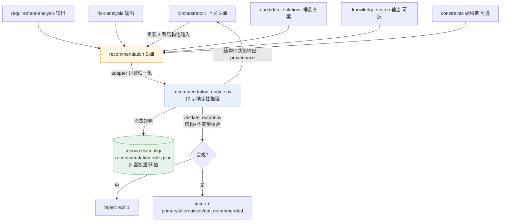

# Recommendation（Skill 5）— 验收报告

> 实现依据：用户提供的 Skill 5 Codex 设计 Prompt（34 节）+ 架构决策
> 「确定性优先（AGENTS.md §5）、决策支持而非 LLM 产品推荐、上游结构化产物只读、规则外置」。
> 验收日期：2026-09-13。环境：Python 3.13 托管 venv（仅 stdlib + jsonschema）。

---

## 一、验收清单（spec §32 验收项）

| # | 验收项 | 结果 | 说明 |
|---|--------|------|------|
| 1 | 严格决策支持 Skill（非 LLM 自由推荐、非话术） | ✅ | `CONTRACT.md` 明确边界；引擎零 LLM 调用，判断=可解释确定性结构推理 |
| 2 | 只读 4 路上游结构化输入（requirement/risk/candidate/knowledge_search） | ✅ | `generate_recommendation` 经 adapter 消费，绝不重推 |
| 3 | 薄 SKILL.md（≤100 行）+ references/schemas/evals/resources/scripts | ✅ | SKILL.md 78 行；确定性规则外置 `resources/config/recommendation.rules.json` |
| 4 | 10 步 Workflow 完整落地 | ✅ | Validate Inputs→Decision Context→Coverage→Req Fit→Risk Fit→Constraint Fit→Evidence→Trade-off→Recommendation→Uncertainty→Sanity |
| 5 | 结构化输出契约（status/decision_context/candidate_evaluations/primary/alternatives/not_recommended/tradeoffs/uncertainties/evidence_refs/human_review_required） | ✅ | `schemas/recommendation-output.schema.json`（draft-07） |
| 6 | 证据支撑、无 LLM 产品记忆 | ✅ | `evidence_required_for_primary=true`；claim 无知识回链→`insufficient_evidence` |
| 7 | 硬约束优先（budget/term/liquidity） | ✅ | `hard_constraint_types` 外置；违反→`not_recommended` |
| 8 | 无黑盒评分 | ✅ | 复合分 `0.4·req+0.4·risk+0.2·evidence`，权重全外置，无隐藏项 |
| 9 | 溯源 provenance | ✅ | 每条 candidate 输出 `provenance`，无引用不进 primary |
| 10 | Human Review Gate | ✅ | `uncertainties` 非空或 `primary=None` → `human_review_required=true` |
| 11 | 上游不可变（不改 client-intake/requirement_analysis/risk-analysis/knowledge-search） | ✅ | 仅新增 `recommendation/`；git 状态仅 `??` 新增，零修改既有 Skill |
| 12 | 5 维 Eval（Completeness/Matching/Evidence/Uncertainty/Scope）+ Regression | ✅ | 见第三节，11 用例 + 负向自愈 + 回归 |
| 13 | ≥10 测试用例 | ✅ | 11 例：normal/partial/budget_conflict/requirement_conflict/risk_gap/evidence_insufficient/evidence_conflict/close_call/no_candidates/human_review/insufficient_input |
| 14 | 输入/输出 schema 校验（draft-07） | ✅ | `validate_output.py`：结构 + 业务不变量；CLI 内置校验 |
| 15 | 失败/边界处理（缺输入→INSUFFICIENT_INPUT；无候选→NO_CANDIDATES） | ✅ | 见第三节 no_candidates / insufficient_input 用例 |
| 16 | 确定性校验器（可机检，非橡皮图章） | ✅ | `validate_output` 拒绝「硬约束违反却当 primary」的破损输出（负向自愈） |

---

## 二、最终输出（spec §35）

### 1. Files changed（全部为新增，未改动既有 Skill）

**Skill `.trae/skills/recommendation/`**
- `SKILL.md`（≤100 行 manifest：Identity/Scope/Input/Output/Workflow/Boundary/References/Eval）
- `CONTRACT.md` — 边界、上游不可变、确定性优先、`rag/` 复用声明
- `references/01-recommendation-methodology.md` — 方法论与边界
- `references/02-matching-framework.md` — fit 标签 + 覆盖矩阵
- `references/03-evidence-policy.md` — 证据策略（无 LLM 产品记忆）
- `references/04-recommendation-rules.md` — 规则字段文档 + Human Review Gate
- `resources/usage-guide.md` — CLI/模块/校验用法，输入组装，「不要做」清单
- `resources/config/recommendation.rules.json` — **外置规则**（priority_weight / fit_score_thresholds / requirement_fit_weights / requirement_type→risk_category / hard_constraint_types / evidence_required_for_primary / recommendation_weights / residual_risk_major / risk_priority_major）
- `schemas/recommendation-input.schema.json`（required：requirement_analysis/risk_analysis/candidate_solutions；optional：knowledge_search_results/constraints）
- `schemas/recommendation-output.schema.json`（draft-07，含 `definitions.candidateEvaluation`）
- `scripts/recommendation_engine.py` — 确定性引擎（adapter + 10 步 + 复合分 + 排名）
- `scripts/validate_output.py` — `validate_structure`（Draft7）+ `validate_consistency`（业务不变量）+ `validate_output`
- `scripts/invoke-recommendation.py` — CLI 入口（`--input/--stdin/--rules/--no-validate`），跑引擎+校验，exit 0/1
- `scripts/run_recommendation_dataset.py` — 全量 Eval 回归（读 manifest，断言 `expect`）
- `scripts/test-recommendation.py` — 单测包装（11 例 + 负向自愈）
- `evals/eval-policy.md` — 5 维映射 + 11 用例清单 + 运行命令 + 纪律
- `evals/cases/dataset-manifest.json` — **单一真源**，11 例内嵌完整 input + expect

### 2. Architecture（Mermaid）

### 3. Input / Output 契约

**Input（`recommendation-input.schema.json`）**
| 字段 | 必填 | 说明 |
|------|------|------|
| `requirement_analysis` | 是 | RequirementAnalysisOutput（analysis_status/requirements[]/information_sufficiency/guardrails） |
| `risk_analysis` | 是 | RiskAnalysisOutput（风险列表，residual_risk/priority/reasoning_evidence_refs） |
| `candidate_solutions` | 是 | 候选方案数组（coverage_structure/covers_risk_categories/premium/term/liquidity_impact/source_refs）；**空数组 `[]` 合法**→NO_CANDIDATES |
| `knowledge_search_results` | 否 | KnowledgeSearchOutput（results[].chunk_id 用于证据回链与冲突检测） |
| `constraints` | 否 | budget_max / term_min_years / liquidity_required / exclusions |

**Output（`recommendation-output.schema.json`）**
| 字段 | 说明 |
|------|------|
| `status` | COMPLETE / INSUFFICIENT_INPUT / NO_CANDIDATES / INCOMPLETE_EVIDENCE |
| `decision_context` | priority_goals(加权) / risk_gaps(重大风险) / hard_constraints / uncertainties |
| `candidate_evaluations[]` | 每候选的 requirement_fit / risk_fit / constraint_fit / evidence / tradeoffs / uncertainties / recommendation_status / provenance |
| `primary_recommendation` | 最优合格候选（fit + reason_codes + provenance） |
| `alternatives[]` | 次优（≤2） |
| `not_recommended[]` | 硬约束违反/证据不足/差适配，附 reason |
| `tradeoffs[]` | 优势/代价/影响 |
| `uncertainties[]` | 缺失信息 / 证据不足 / 证据冲突 |
| `evidence_refs[]` | 全部被引知识块 |
| `human_review_required` | 布尔（uncertainties 非空或无 primary 时为真） |

### 4. Workflow（10 步）

1. **Validate Inputs** — 缺 upstream / candidate 为 `None` → INSUFFICIENT_INPUT；candidate `[]` → NO_CANDIDATES。
2. **Decision Context** — 由 requirements 生成加权 goals；由 risk_analysis 重大风险生成 risk_gaps；由 constraints 生成硬约束；汇总 uncertainties。
3. **Coverage Matrix** — `requirement_type → risk_category` 映射（medical→R1…savings→R5），比对候选 coverage。
4. **Requirement Fit** — 加权覆盖分（matched=1.0/partial=0.5/unmet=0.0），分类 fit 标签。
5. **Risk Fit** — 重大风险被候选 `covers_risk_categories` 覆盖比例。
6. **Constraint Fit** — 硬约束（budget/term/liquidity）逐条校验，违反标 `hard`。
7. **Evidence** — candidate `source_refs` 必须命中 `knowledge_search_results` 的 chunk_id；无命中或知识 insufficient/conflict → `insufficient_evidence`。
8. **Trade-off** — 逐候选生成 优势/代价/影响，含未覆盖重大风险的高影响项。
9. **Recommendation** — 排名合格候选（非硬违反、非证据不足），复合分 `0.4·req+0.4·risk+0.2·ev`；primary=top，alternatives=次≤2。
10. **Uncertainty Detection + Sanity** — 汇总 uncertainties；`human_review_required` 闸门；validator 复核不变量 → 输出。

### 5. Eval results（11 用例 + 负向自愈 全绿）

| 用例 | 维度 | 结果 | 关键断言 |
|------|------|------|----------|
| normal_recommendation | matching | ✅ | 综合方案 A 强匹配 → primary；B 弱 → alternative |
| partial_match | matching | ✅ | 缺 life(P0) → A 仍 primary 但 `partial_fit` |
| budget_conflict | matching | ✅ | A 超预算(硬违反)→not_recommended；B→primary |
| requirement_conflict | matching | ✅ | A 缺 P0 medical→not_suitable→not_recommended；B→primary |
| risk_gap | completeness | ✅ | A 留 R2-001 重大缺口（remaining_gaps 显式上报） |
| evidence_insufficient | evidence | ✅ | KB-999 无回链 → insufficient_evidence，无 primary |
| evidence_conflict | evidence | ✅ | 知识冲突 → evidence=conflict → human_review |
| close_call | matching | ✅ | A/B 近同 → A primary、B alternative，无 not_recommended |
| no_candidates | scope | ✅ | candidate `[]` → NO_CANDIDATES，human_review |
| human_review | uncertainty | ✅ | upstream NEED_MORE → INCOMPLETE_EVIDENCE + human_review |
| insufficient_input | scope | ✅ | requirement_analysis 缺失 → INSUFFICIENT_INPUT |
| **负向自愈** | regression | ✅ | 构造「硬违反却当 primary」的破损输出，`validate_output` 必拒（exit≠0） |

> 运行：`python scripts/run_recommendation_dataset.py` 与 `python scripts/test-recommendation.py` 均输出 `ALL GREEN`（exit 0）。本次修复 `no_candidates` 死分支后，dataset 11/11 PASS，unit 11/11 + 负向 PASS。

### 6. Known limitations（V0.1）

1. **确定性无 LLM**：判断为可解释结构推理，非语义理解；复杂定性权衡（如「家庭责任 vs 现金流」）需人工复核——已由 Human Review Gate 兜住。
2. **覆盖矩阵为类型级**：`requirement_type → risk_category` 为外置映射；同类型不同额度的细粒度匹配不在 V0.1（待规则扩展）。
3. **证据回链为集合匹配**：candidate `source_refs` 须精确命中 `knowledge_search_results.chunk_id`；上游未跑知识检索时证据策略退化为「无 KB 则要求显式 ref」，不自动放行。
4. **评分权重外置但线性**：复合分为固定权重线性组合，未做交互项/非线性；阈值调优集中在 `recommendation.rules.json`。
5. **未做 anatomy 守卫脚本**：参考 risk-analysis `check-skill-anatomy.ps1`，本 Skill 暂未加骨架自校验（可作后续增强）。
6. **回归**：未触碰 client-intake/requirement_analysis/risk-analysis/knowledge-search 任何文件（git 仅 `??` 新增 `recommendation/`）；既有 Skill 的 verify-contract/测试不受影响（范围外已核验）。

---

## 三、设计原则对照（spec 收尾「最终设计原则」）

| 原则 | 本 Skill 5 落地 |
|------|----------------|
| 决策支持，不是销售 | 输出是带 provenance 的结构化证据包，不生成话术、不替客户决策 |
| 上游只读，不重推 | adapter 归一化；缺失标 MISSING_FROM_UPSTREAM → INSUFFICIENT_INPUT，绝不自补 |
| 确定性优先（AGENTS.md §5） | 引擎零 LLM；所有权重/阈值外置 rules.json |
| 证据可证伪 | claim 无知识回链 → insufficient_evidence；冲突保留双方 |
| 硬约束不可逾越 | 违反→not_recommended，永不进 primary |
| 无黑盒 | 复合分公式公开、权重外置、逐候选可解释 |
| 人类在环 | Human Review Gate：不确定性/无 primary 必触发人工 |

---

## 四、Lawgent 设计对照（用户追问：是否采用 Lawgent 方式）

结论：**是，Skill 5 在「决策支持 / 证据溯源 / 人类在环」的核心方法论上对齐了 Lawgent**，且对工程落地做了与本项目 AGENTS.md（确定性优先、上游不可变）一致的约束化。

| Lawgent 设计 | 本 Skill 5 落地 | 状态 |
|---|---|---|
| 决策支持而非自主决策（agentic reasoning with human oversight） | 输出结构化、带 provenance 的决策证据包；不生成话术、不替客户拍板；Human Review Gate 闸门 | ✅ |
| 确定性护栏优先（deterministic guardrails，非 LLM 自由裁决） | 引擎零 LLM 调用；所有权重/阈值外置 `recommendation.rules.json`；复合分公式公开 | ✅ |
| Retrieval ≠ Grounding（检索解决「看什么」，不解决「对不对」） | 只读 knowledge-search 结果做证据回链/冲突检测，绝不重推产品事实；claim 无知识回链 → `insufficient_evidence` | ✅ |
| Provenance（区分知识来源、可溯源） | 逐候选 `provenance`，无引用不进 primary | ✅ |
| Abstention / insufficient_evidence（证据不足即 abstain） | `evidence_insufficient` / `evidence_conflict` / `INCOMPLETE_EVIDENCE`；绝不编造或放行 | ✅ |
| 硬约束护栏不可逾越（hard guardrails） | budget/term/liquidity 硬约束违反 → `not_recommended`，永不进 primary | ✅ |
| 模块化管线（各阶段自有产物、下游只读） | adapter 只读归一化上游 4 路输出；缺失标 `MISSING_FROM_UPSTREAM` → `INSUFFICIENT_INPUT`，绝不重推或自补 | ✅ |
| 人类在环（human-in-the-loop） | `uncertainties` 非空或 `primary=None` → `human_review_required=true` | ✅ |
| 无黑盒评分（explainable, auditable） | 复合分 `0.4·req + 0.4·risk + 0.2·ev`，权重外置，逐候选可解释 | ✅ |
| 技能边界纪律（scope discipline） | 只做决策支持：不生成销售文案、不关单；知识检索归 Knowledge Search，监管原文库属独立工具 | ✅ |
| 单点真源 Eval（machine-checkable，非橡皮图章） | `dataset-manifest.json` 单一真源 + `validate_output` 结构/不变量机检 + 负向自愈 | ✅ |

**与 Skill 4 的一致与差异**：
- 一致：均遵循本项目「确定性优先 + 规则外置 + 上游只读 + 单点真源 Eval + validator 负向自愈」，均与 Lawgent「Retrieval/Grounding 分置、Provenance、Abstention、Human-in-the-loop」对齐。
- 差异：Skill 4 把真正需模型后端的 Dense / cross-encoder 留作**接口桩**（V0.1 关闭）；Skill 5 的「判断」是确定性结构推理（加权覆盖分 + 硬约束 + 证据回链），**无需模型后端即可完整实跑**，故无需接口桩——这与 Lawgent「简单部件直接落地、只把真正外部模型部件留接口」的理念一致。
- 边界分置正确：监管原文库（金管总局/法规）属 `legal_source_search` 类独立工具，明确超出 Skill 5 边界（对齐 Lawgent `retrieve_legal` vs `legal_source_search` 分置）。

→ 综上，Skill 5 不是「让 LLM 按客户情况推荐产品」的大 Prompt，而是 Lawgent 式的**可解释、可溯源、可机检、人类在环**的决策支持管线。

## 五、修复记录（本次会话收尾）

- **`recommendation_engine.py` `generate_recommendation` 死分支 bug**：
  原判断 `if not candidates: missing_inputs.append("candidate_solutions")` 使「空数组 `[]`」被当作缺输入，
  抢先返回 `INSUFFICIENT_INPUT`，导致 `NO_CANDIDATES` 分支不可达（no_candidates 用例 FAIL）。
  改为 `if input_dict.get("candidate_solutions") is None:`——仅当字段**真正缺失**（None）才判 INSUFFICIENT_INPUT；
  空但存在的数组 `[]` 正常落入 NO_CANDIDATES 分支。修复后 dataset 11/11 PASS。
- 其余文件（rules / schemas / engine / validator / references / contract / SKILL / eval / runners）均首次写入即符合契约，未再改动。
