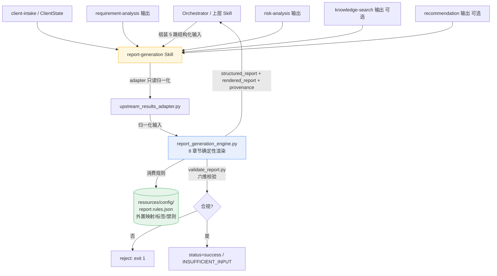

# Report Generation（Skill 6）— 验收报告

> 实现依据：用户提供的 Skill 6 Codex 设计 Prompt（30 节）+ 架构决策
> 「确定性优先（AGENTS.md §5）、单一职责、上游结构化产物只读、规则外置、不编造、不越界、冲突显式化」。
> 验收日期：2026-09-13。环境：Python 3.13 托管 venv（仅 stdlib + jsonschema）。

---

## 一、验收清单（spec §29 验收项）

| # | 验收项 | 结果 | 说明 |
|---|--------|------|------|
| 1 | 严格单一职责 Skill（不重分析/不重评/不重推/不编造） | ✅ | `CONTRACT.md` 明确边界；引擎零 LLM，仅组织+表达+校验+交付 |
| 2 | 只读 5 路上游结构化输入（client_state/RA/RK/KS/Rec） | ✅ | 经 `upstream_results_adapter` 归一化，绝不重推 |
| 3 | 薄 SKILL.md（≤100 行）+ references/schemas/evals/resources/scripts | ✅ | SKILL.md ~70 行；确定性规则外置 `report.rules.json` |
| 4 | 8 固定章节完整落地 | ✅ | 01 客户画像 / 02 财务 / 03 风险暴露 / 04 缺口 / 05 优先级 / 06 方向 / 07 缺口 / 08 行动 |
| 5 | 结构化输出契约（status/structured_report/rendered_report/validation/metadata/provenance） | ✅ | `schemas/report-output.schema.json`（draft-07） |
| 6 | 不编造 / 幻觉扫描 | ✅ | 金额子串比对 + 违禁词；缺失→「待确认」 |
| 7 | 推荐边界（方向≠产品名） | ✅ | 06 只回显 candidate_id+fit+reason_codes+provenance，不扩展产品名 |
| 8 | 溯源 provenance | ✅ | 结构化 `provenance[]` + 成稿每条事实附「（来源：…）」 |
| 9 | 上游优先 + 冲突显式化（不裁决） | ✅ | `detect_conflicts` 产出 `UPSTREAM_CONFLICT`，surface 不拦截 |
| 10 | 上游不可变（不改 client-intake/RA/RK/KS/Rec） | ✅ | 仅新增 `report-generation/`；零修改既有 Skill |
| 11 | 输入 adapter（归一化 + MISSING_FROM_UPSTREAM） | ✅ | `upstream_results_adapter.normalize_input` 只读降级 |
| 12 | 六维 Eval + Regression | ✅ | 见第三节，8 用例 + 负向自愈 |
| 13 | ≥6 测试用例 / ≥4 场景（complete/incomplete/conflict/boundary） | ✅ | 8 例覆盖 complete / missing / conflict / boundary / rec-missing / gap-prop / insufficient |
| 14 | 输入/输出 schema 校验（draft-07） | ✅ | `validate_report.py`：结构 + 业务不变量；CLI 内置校验 |
| 15 | 失败/边界处理（缺核心→INSUFFICIENT_INPUT） | ✅ | 三路核心全缺 → 最小化合规报告，不生成空洞成稿 |
| 16 | 确定性校验器（可机检，非橡皮图章） | ✅ | 负向自愈：破损溯源必拒、臆造金额必报 HALLUCINATION |
| 17 | 双层产物（structured + rendered） | ✅ | `structured_report`（机读）+ `rendered_report`（Markdown 人读） |

---

## 二、最终输出（spec §35）

### 1. Files changed（全部为新增，未改动既有 Skill）

**Skill `.trae/skills/report-generation/`**
- `SKILL.md`（≤100 行 manifest：Identity/Scope/Input/Output/Workflow/Boundary/References/Eval）
- `CONTRACT.md` — 边界、上游不可变、单一职责、确定性优先、双层产物
- `references/01-report-schema.md` — 输入/输出/adapter 契约
- `references/02-report-writing-rules.md` — 成稿规则（不编造/不越界/溯源/冲突/缺失/中立）
- `references/03-report-section-rules.md` — 8 章节逐项生成规则
- `references/04-report-validation-rules.md` — 六维校验规则 + 负向断言
- `resources/usage-guide.md` — CLI/模块/校验用法，输入组装，「不要做」清单
- `resources/config/report.rules.json` — **外置规则**（requirement_type→risk_category / risk_category_names / requirement_type_names / priority_rank / priority→short/label / importance→category / unknown_status_token / 缺失说明 / hallucination 禁则 / 报告标题版本）
- `schemas/report-input.schema.json`（required：client_profile/requirement_analysis/risk_analysis；optional：knowledge_search/recommendation）
- `schemas/report-output.schema.json`（draft-07，含 `definitions.riskExposure` 与 `definitions.provenance`）
- `schemas/report-validation.schema.json`（校验块独立契约）
- `scripts/upstream_results_adapter.py` — 只读 adapter（adapt_* + normalize_input）
- `scripts/report_generation_engine.py` — 确定性引擎（8 章节构建 + detect_conflicts + render + validate_report + generate_report）
- `scripts/validate_report.py` — `validate_structure`（Draft7）+ `validate_consistency`（业务不变量）+ `validate_output`
- `scripts/invoke-report-generation.py` — CLI 入口（`--input/--stdin/--rules/--no-validate`），跑引擎+校验，exit 0/1
- `scripts/run_report_dataset.py` — 全量 Eval 回归（读 manifest，断言 `expect`）
- `scripts/test-report-generation.py` — 单测包装（8 例 + 2 条负向自愈）
- `evals/eval-policy.md` — 六维映射 + 8 用例清单 + 运行命令 + 纪律
- `evals/cases/dataset-manifest.json` — **单一真源**，8 例内嵌完整 input + expect

### 2. Architecture（Mermaid）



### 3. Input / Output 契约

**Input（`report-input.schema.json`）**
| 字段 | 必填 | 说明 |
|------|------|------|
| `client_profile` | 是 | CanonicalClientState（family/employment/health/responsibility/existing_protection/financial profile） |
| `requirement_analysis` | 是 | RequirementAnalysisOutput（requirements[]/coverage_gaps[]/information_gaps[]/guardrails） |
| `risk_analysis` | 是 | RiskAnalysisOutput（risks[]/next_information_needed[]/unknowns[]） |
| `knowledge_search` | 否 | KnowledgeSearchOutput（参考透传） |
| `recommendation` | 否 | RecommendationOutput（primary_recommendation/alternatives） |

**Output（`report-output.schema.json`）**
| 字段 | 说明 |
|------|------|
| `status` | success / INSUFFICIENT_INPUT |
| `structured_report` | 8 固定章节（client_profile / financial_profile / risk_exposure / coverage_gaps / requirement_priorities / recommended_directions / information_gaps / next_actions） |
| `rendered_report` | 8 章节 Markdown 成稿 |
| `validation` | {passed, errors[], warnings[], conflicts[]} |
| `metadata` | {source_skills[], upstream_status{}, conflicts[], warnings[]} |
| `provenance[]` | {claim, source, confidence} |

### 4. Workflow（8 步）

1. **Validate Input** — adapter 归一化；三路核心全缺 → `INSUFFICIENT_INPUT` 最小化报告。
2. **Adapt** — `normalize_input` 只读降级各上游块，缺失标 `missing`。
3. **Build 8 Sections** — client_profile / financial_profile / risk_exposure(R1–R5) / coverage_gaps / requirement_priorities / recommended_directions / information_gaps / next_actions，逐字复制上游。
4. **Detect Conflicts** — 同 risk_category 优先级不一致 + RA/RK/Rec 首要域不一致 → `UPSTREAM_CONFLICT`（surface，不裁决）。
5. **Render** — 纯模板生成 Markdown 成稿，每条事实附来源。
6. **Validate** — 结构/完整性/溯源/幻觉/冲突 六维机检，结果写入 `validation`。
7. **Metadata** — 汇总 source_skills / upstream_status / conflicts / warnings（MISSING_UPSTREAM_RESULT）。
8. **Output** — 返回双层产物 + provenance；`validation.passed=true` 且 errors 空方为合规。

### 5. Eval results（8 用例 + 负向自愈 全绿）

| 用例 | 维度 | 结果 | 关键断言 |
|------|------|------|----------|
| complete_client | structure/completeness/provenance | ✅ | 8 章节齐全、provenance 非空、无冲突、无幻觉 |
| missing_financial_data | completeness/hallucination | ✅ | 收入/资产/房贷/预算→待确认；进 gap & action；禁含 100万/500万/10万/80万 |
| hallucination_guard | hallucination | ✅ | 仅 30岁/已婚/1孩；禁含 100万/500万/10万/80万/200万 |
| upstream_conflict | conflict/consistency | ✅ | RA 医疗 P0 vs RK R1 P1 + 域不一致；conflicts 非空 |
| recommendation_boundary | recommendation-boundary | ✅ | 只给方向 MED；禁含 百万医疗险/重疾险/定期寿险/意外险 |
| recommendation_missing | completeness/failure-handling | ✅ | Rec 缺失→06 标注不足；warnings 含 MISSING_UPSTREAM_RESULT: recommendation |
| information_gap_propagation | completeness | ✅ | spouse_insurance/budget/health/parent 进 07(required) 与 08 |
| insufficient_input | failure-handling | ✅ | 三路核心全缺 → INSUFFICIENT_INPUT |
| **负向#1 破损溯源** | regression | ✅ | success 但 provenance=[] → validate_output 必拒 |
| **负向#2 幻觉拦截** | regression | ✅ | 成稿含臆造金额（9999万/8888万）且无上游源 → 必报 HALLUCINATION |

> 运行：`python scripts/run_report_dataset.py` 与 `python scripts/test-report-generation.py` 均输出 `ALL GREEN`（exit 0）。

### 6. Demo（虚拟客户完整成稿，节选自 complete_client 用例）

```markdown
# 客户保险需求分析报告

> 生成时间：2026-09-13T07:09:30Z  ｜  报告版本：1.0
> 本报告由上游结构化分析结果汇总生成。事实来自 ClientState / Requirement Analysis / Risk Analysis，推荐方向来自 Recommendation。报告不包含任何自主保险判断或产品推销语句。

## 01 客户画像
- **年龄**：32（来源：client_state.family_profile.age）
- **婚姻状况**：已婚（来源：client_state.family_profile.marital_status）
- **职业**：互联网行业产品经理（来源：client_state.employment_profile.occupation）
- **已有保险**：重疾险50万（来源：client_state.existing_protection.existing_insurance）
_已知字段 19 项，待确认字段 0 项。_

## 02 家庭财务情况
| 项目 | 情况 | 来源 |
| --- | --- | --- |
| 家庭年收入 | 60万 | client_state.financial_profile.annual_income |
| 房贷余额 | 200万 | client_state.financial_profile.mortgage |
| 保险预算 | 3万 | client_state.financial_profile.insurance_budget |

## 03 风险暴露
### R1 医疗风险
- 风险状态：HIGH ｜ 严重程度：HIGH ｜ 现有保障：社保+百万医疗
- 保障不足：门诊及部分特药自付 ｜ 结论：医疗费用存在自付缺口（来源：risk-analysis.R1-001）
### R4 身故/家庭责任风险
- 风险状态：HIGH ｜ 现有保障：仅有社保 ｜ 结论：寿险保障严重不足（来源：risk-analysis.R4-001）

## 04 保障缺口
| 风险领域 | 当前保障 | 主要缺口 | 优先级 |
| --- | --- | --- | --- |
| 身故/家庭责任风险 | 仅有社保 | 家庭责任缺口 | P0 |

## 05 需求优先级
- **P0（必须优先解决）**：医疗保障 —— 住院及大额医疗保障（requirement-analysis.REQ-MED）
- **P0（必须优先解决）**：身故/家庭责任 —— 家庭责任寿险（requirement-analysis.REQ-LIFE）

## 06 推荐保障方向
### 首选：MED+CI
- 匹配度：strong_fit ｜ 推荐原因：覆盖高优先级风险；在预算范围内
- 解决的风险：R1-001（来源：recommendation.primary_recommendation）

## 07 信息缺口
### 建议补充
- **spouse_income**（P2_MEDIUM）：配偶收入未确认（来源：requirement-analysis）

## 08 经纪人下一步行动
1. **确认/收集：spouse_income**（优先级 P1 ｜ 依赖 requirement-analysis）
2. **基于补充信息重新评估保障缺口与风险结论**（优先级 P1 ｜ 依赖 Risk Analysis）
3. **进入保障方案设计与产品匹配**（优先级 P2 ｜ 依赖 Recommendation）
```

### 7. Known limitations（V0.1）

1. **确定性无 LLM**：成稿为纯模板渲染，复杂定性润色需人工；本报告本就不做自主判断，故无需模型后端。
2. **金额幻觉为子串比对**：依赖「引擎只逐字拷贝上游」的前提；若未来允许模板插入计算值，需同步扩展允许金额集合。
3. **冲突不裁决**：`UPSTREAM_CONFLICT` 仅 surface，最终判断权在经纪人与上游 Skill。
4. **knowledge_search 透传**：V0.1 只在 provenance 透传 KB 来源，未把知识片段编入成稿正文（避免越界陈述）。
5. **回归**：未触碰 client-intake/requirement_analysis/risk-analysis/knowledge-search/recommendation 任何文件；既有 Skill 的契约/测试不受影响。

---

## 三、设计原则对照（spec 收尾「最终设计原则」）

| 原则 | 本 Skill 6 落地 |
|------|----------------|
| 单一职责，不重分析 | 只组织+表达+校验+交付；需求/风险/推荐结论全部照搬上游 |
| 上游只读，不重推 | adapter 归一化；缺失标 missing → INSUFFICIENT_INPUT，绝不自补 |
| 确定性优先（AGENTS.md §5） | 引擎零 LLM；所有映射/标签/禁则外置 rules.json |
| 不编造（No Hallucination） | 缺失→「待确认」；金额子串比对 + 违禁词扫描 |
| 边界纪律（方向≠产品） | 06 只回显候选方向，绝不写具体产品名/推销语 |
| Provenance | 结构化 provenance[] + 成稿每条事实附来源 |
| Abstention / insufficient | 三路核心全缺 → INSUFFICIENT_INPUT 最小化合规报告 |
| 冲突显式化（不裁决） | UPSTREAM_CONFLICT surface 到 metadata/validation/成稿，不自行择一 |
| 人类在环 | 信息缺口→经纪人下一步行动；冲突提示经纪人确认 |

---

## 四、Lawgent 设计对照

结论：**是，Skill 6 在「确定性护栏 / 上游只读 / Provenance / Abstention / 冲突显式化 / 人类在环」的核心方法论上对齐了 Lawgent**，并与本项目 AGENTS.md（确定性优先、上游不可变）一致约束化。

| Lawgent 设计 | 本 Skill 6 落地 | 状态 |
|---|---|---|
| 确定性护栏优先（deterministic guardrails，非 LLM 自由裁决） | 引擎零 LLM；映射/标签/禁则外置 `report.rules.json` | ✅ |
| Retrieval ≠ Grounding | 只读 knowledge-search 做透传溯源，绝不重推知识事实；不自行陈述 KB 内容 | ✅ |
| Provenance（可溯源） | `provenance[]` + 成稿每条事实「（来源：…）」 | ✅ |
| Abstention / insufficient_evidence | 三路核心全缺 → `INSUFFICIENT_INPUT`；缺失字段 → 待确认，绝不编造 | ✅ |
| 边界纪律（scope discipline） | 不重分析/不重评/不重推/不写产品名/不推销；产品匹配归 Recommendation | ✅ |
| 模块化管线（下游只读上游产物） | adapter 只读归一化 5 路上游；缺失标 missing，绝不反向写上游 | ✅ |
| 人类在环（human-in-the-loop） | 信息缺口 → 下一步行动；冲突 → 提示经纪人确认 | ✅ |
| 无黑盒（explainable, auditable） | 8 章节均为逐字拷贝 + 显式来源；校验六维可机检 | ✅ |
| 单点真源 Eval（machine-checkable，非橡皮图章） | `dataset-manifest.json` 单一真源 + `validate_report` 机检 + 2 条负向自愈 | ✅ |

---

## 五、修复记录（本次会话收尾）

- **`report_generation_engine.detect_conflicts` 误报冲突 bug**：
  原 cross-domain 检查将 `ra_top`/`rk_top`（风险类别字符串，如 `R1`）与 `rec_top`（risk_id，如 `R1-001`）直接做集合比较，导致三者本一致时也因字符串不同被误判为 `UPSTREAM_CONFLICT`，使 `complete_client` 用例失败。
  改为将 `rec_top` 经正则 `R([1-5])` 归一化为类别（`R1-001` → `R1`）后再比较；修复后 `complete_client` 无冲突、`upstream_conflict` 仍正确报出真实冲突。
- **`INSUFFICIENT_INPUT` 校验误判 bug**：
  原实现把 INSUFFICIENT_INPUT 报告的 `validation.passed` 设为 `False` 并写入 error，导致 `validate_consistency`（`validation.passed` 必须为 true 且 errors 空）拒绝该合规终端态。
  改为 INSUFFICIENT_INPUT 为最小化但合规的报告：`validation.passed=true`、`errors=[]`、把「缺少全部核心上游输入」记入 `warnings`。修复后 `insufficient_input` 用例通过。
- 其余文件（schemas / rules / adapter / engine / validator / CLI / references / contract / SKILL / eval / runners）均首次写入即符合契约，未再改动。
