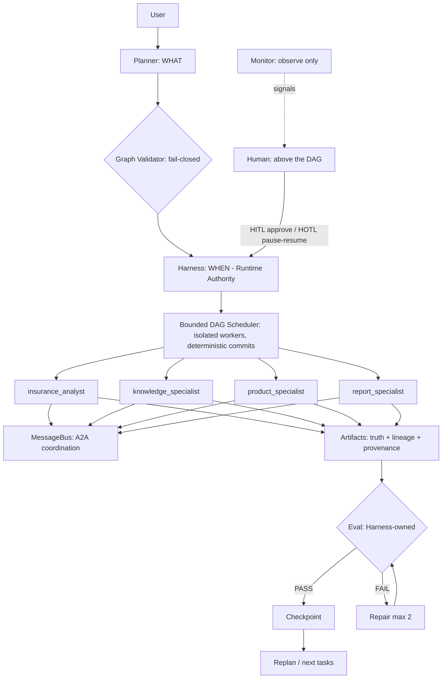

# Long-running Multi-Agent Runtime

> Language: English | [中文版](README.zh-CN.md)

**A state-driven runtime that plans, executes, evaluates, repairs, replans
and supervises long-running agent workflows.**
Insurance is the first domain adapter — a software-engineering workflow
runs on the same runtime to prove the runtime is generic.

```text
Traditional LLM app:    Prompt -> LLM -> Answer

This runtime:           Request -> Planner -> Task Graph -> Long-running Harness
                        -> Specialist Agents -> Artifacts -> Eval -> Repair
                        -> Replanning -> Human Control -> Recoverable Result
```

```text
Insurance Agent          -> the demonstration workload
Agent Runtime / Harness -> the engineering contribution
```

**My contribution** — the architecture and semantics: planner/validation
design, task lifecycle, scheduler semantics, agent/skill/tool boundaries,
eval strategy, repair/replan semantics, HITL/HOTL control design,
checkpoint/recovery, benchmark & red-team design, domain-adapter
generalization, productization. (AI coding tools were used as dev tooling;
the system design and its proofs are the point.)

---

## Why I built it

A single LLM call cannot deliver **work**: multi-step tasks that run long,
need several specialists, fail partially, require evidence, and need a
human who can intervene without becoming a bottleneck. This project builds
the missing execution layer — the agent *runtime*, not another prompt.

## 5-minute demo

```bash
python -m demos.demo_portfolio
```

Six acts, all real execution: problem -> planner -> 4-agent parallel run ->
runtime trace from the durable event log -> failure/replan/HITL/HOTL
recovery -> deliverable with provenance -> second-domain swap.
[Narrated script (5 & 10 min)](docs/portfolio/demo-script.md).

## Architecture



Authority boundaries: **Harness** = runtime authority (sole state writer);
**Planner** = plan authority (untrusted -> validated); **Agents** =
execute/request (never PASS); **Eval** = quality gate (never inside a
tool); **Artifacts** = source of truth; **Monitor** = observe only;
**Human** = approve/intervene via the control plane, never direct edits.

## Multi-agent collaboration

4 specialists with deterministic assignment and scoped tools (the analyst
physically cannot name products); coordination only through a validated,
persistent A2A MessageBus (ACK after PASS); parallel branches on the
bounded DAG scheduler with worker isolation — the scheduler is the only
state writer, so results stay deterministic under concurrency.

## Evaluation & reliability

Every artifact passes a deterministic, harness-owned eval (schema, required
fields, product-leakage contamination, provenance, cross-artifact refs,
catalog invariants) with bounded repair (max 2), then fail-closed
NEEDS_REVIEW. Failures never fake success: empty knowledge stores no
fabricated evidence; LLM outages fail closed; an adversarial false-pass
suite proves bad inputs are rejected (count 0).

## Human control

- **HITL** — human as decision gate: high-impact graph changes pause in
  WAITING_HUMAN; approve/reject; rejection fails closed.
- **HOTL** — human as supervisor above the DAG: a deterministic monitor
  raises risk signals; policy decides NOTIFY/PAUSE; pause lands at a safe
  barrier (never mid-commit); audited idempotent commands.

## Insurance case study (first domain adapter)

A realistic (fictional) family case — 30-year-old married father,
newborn, 500k income, planned 2M mortgage — runs the full pipeline:
facts -> requirements -> risk -> gap -> solution -> knowledge ->
candidates -> report, with provenance from report back to client facts.
`python -m demos.demo_insurance` · [runtime trace](docs/runtime-trace.md)

## Generalization: software engineering (second domain)

Same planner/harness/scheduler/eval/artifact stack; a ~40-line
declarative domain adapter (task catalog, agents, workflow, eval rules);
zero runtime fork. 5/5 tasks, 5/5 evals, lineage verified, COMPLETED.
`python -m demos.demo_generalization` · [audit](docs/generalization.md)

## Benchmark

```bash
python -m evals.benchmark.runner     # 11/11 cases, hard gates all 0
```

11 deterministic scenario cases (happy path, missing info, knowledge/
product failures, repair exhaustion, replanning, parallel equivalence,
HITL, HOTL notify/pause, 4-agent golden) + an 18-row fault-injection
matrix + adversarial false-pass testing + tamper testing (breaking the
runtime breaks the benchmark). [Report](docs/benchmark-report.md)

## Design decisions

13 trade-off records (why not one big agent; why eval is not in the tool;
why the scheduler is local; why HITL and HOTL differ; why no Redis...):
[design-decisions.md](docs/portfolio/design-decisions.md) ·
7 ADRs in [docs/adr/](docs/adr/)

## Limitations (honest)

Validated **portfolio prototype** — single-process, thread-based;
JSON-file persistence (no Redis/Postgres/K8s by design); demo product
catalog (not real insurer data, clearly labelled); real-LLM smoke depends
on external API and fails closed on outage; not production insurance
advice.

## Quick Start

```bash
# 1. deterministic Quick Start — no LLM key, no network, encoding-safe
python -m demos.demo_basic

# 2. more demos (offline, real runtime)
python -m demos.demo_four_agent         # golden 4-agent parallel run
python -m demos.demo_replan             # failure -> controlled replanning
python -m demos.demo_hitl               # human approval gate
python -m demos.demo_hotl               # supervisor pause/resume
python -m demos.demo_portfolio          # the 6-act tour
python -m evals.benchmark.runner        # 11 deterministic benchmark cases

# 3. web app (optional)
python -m runtime.server                # FastAPI + SSE on 127.0.0.1:8000
cd web && npm install && npm run dev    # React UI on localhost:5173

# 4. optional real-LLM smoke (needs provider + network; fails closed)
python -m runtime.agent.smoke_test
```

## Testing

```bash
pytest tests/runtime tests/portfolio -q   # 326 tests
PYTHONIOENCODING=utf-8 python tmp/run_regression.py
```

## Project structure

```text
runtime/      the agent runtime (planner, harness, agents, A2A,
              approval, control plane, state, eval, observability, server)
.trae/skills/ insurance skills (9, self-contained: contract + evals)
contracts/    artifact JSON schemas      catalog/  demo product catalog
knowledge/    RAG + evidence provider    demos/    one-command demos
evals/benchmark/  deterministic benchmark + fault injection
tests/        runtime (pytest) + portfolio acceptance (anti-cheat)
docs/         architecture | portfolio | ADRs | benchmark reports
```

## Portfolio / Interview

[Project overview](docs/portfolio/project-overview.md) |
[Agent Developer](docs/portfolio/agent-developer.md) |
[Agent PM](docs/portfolio/agent-pm.md) |
[Architecture interview](docs/portfolio/architecture-interview.md) |
[Interview Q&A (30)](docs/portfolio/interview-qa.md) |
[Resume bullets](docs/portfolio/resume-bullets.md) |
[Verified results](docs/portfolio/project-results.md) |
[Demo script](docs/portfolio/demo-script.md)

## Development history

Built and frozen in 12 audited phases (deterministic pipeline ->
observability -> harness -> planner -> multi-agent -> A2A ->
bounded-parallel scheduler -> dynamic replanning -> HITL -> HOTL ->
benchmark/red-team -> portfolio), each with its own regression suite still
passing. Tagged **v0.1.0** as the portfolio stable version. Details:
[phase history](docs/architecture/overview.md)
