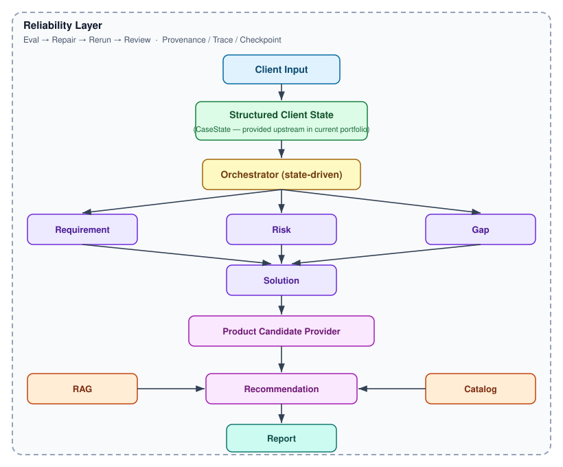

> 🌐 **Language:** 🇨🇳 [中文版](README.zh-CN.md) · 🇺🇸 English

# insurance-agent

A deterministic multi-stage insurance-analysis Agent designed to demonstrate reliable Agent Systems engineering.

```text
Core capabilities:

  - State-driven orchestration
  - Structured artifacts
  - Deterministic fail-closed evaluation
  - Bounded self-repair
  - Evidence provenance
  - Checkpoint / Resume
  - Trace & observability

Portfolio focus:
  Agent Systems reliability, not insurance product accuracy.
```

> **One-sentence positioning**
> A deterministic multi-stage insurance-analysis Agent with state-driven orchestration, fail-closed
> evaluation, bounded self-repair, evidence provenance, checkpoint/resume, and observability.
> （一个具备状态驱动编排、Fail-Closed Eval、有界自修复、证据溯源、Checkpoint/Resume 与可观测性的
> 确定性多阶段保险分析 Agent。）

> **Visual core:** *Generation is easy. Reliable continuation is hard.*

---

## 1. What is this?

`insurance-agent` is a runtime that takes a **structured client state** and walks it through a
fixed data chain — requirement → risk → coverage gap → solution → product candidates →
recommendation → report — while continuously **evaluating, repairing, checkpointing, and tracing**
every step.

It is **not** a chatbot. It is **not** a single LLM call. It is an engineering demonstration of how
to make an agent **continue safely or stop honestly** when inputs are missing, contradictory, or
unsupported by evidence.

```text
Structured Client State
(provided upstream in current portfolio)
        │
        ▼
   Orchestrator  ── state-driven, no business judgment
        │
        ▼
  Skills → Artifacts → Deterministic Eval → Repair → Checkpoint → Trace
        │
        ▼
   Recommended directions (demo catalog, is_demo=true)
```

Full diagram: [`docs/architecture/portfolio-architecture.svg`](docs/architecture/portfolio-architecture.svg)

## 2. Why I built it

Most Agent demos show *successful generation*. This project asks a harder question:

> **How do we make an Agent know when it is safe to continue — and stop when it is not?**

LLMs can produce plausible answers. The unsolved part is *reliability*: when the evidence is thin,
when a field is `UNKNOWN`, when a product doesn't exist in the catalog, the agent must not silently
manufacture a confident result.

So this project treats the following as **first-class runtime concepts**:

```text
State      Artifact    Eval
Repair     Evidence    Checkpoint    Trace
```

That is the actual product. The insurance domain is the *vehicle* for demonstrating it.

## 3. The core engineering problem

An agent that always "succeeds" is not reliable — it is lucky. The real problem is **continuation
safety**:

- When should the agent advance to the next stage?
- When must it block and wait for a human?
- When must it refuse to produce a product rather than hallucinate one?
- When has it tried enough and should escalate?

Every design decision below is in service of making those questions *determinable and auditable*,
not left to model mood.

## 4. Architecture



```text
                     Client Input
                          │
                          ▼
                 ┌───────────────────┐
                 │  Structured Client State (CaseState)  │
                 │  (provided upstream in current portfolio)     │
                 └───────────┬───────────────────────────┘
                             │
                             ▼
                   ┌────────────────────┐
                   │   Orchestrator     │  ← state-driven, no business judgment
                   └─────────┬──────────┘
                             │
         ┌───────────────────┼────────────────────┐
         ▼                   ▼                    ▼
   Requirement           Risk                 Gap
         └───────────────────┼────────────────────┘
                             ▼
                         Solution
                             │
                             ▼
                Product Candidate Provider
                       │           │
                       ▼           ▼
                     RAG        Catalog
                       │           │
                       └─────┬─────┘
                             ▼
                      Recommendation
                             │
                             ▼
                          Report

   ┌────────────────────────────────────────────────────┐
   │            Reliability Layer                        │
   │  Eval → Repair → Rerun → Review                   │
   │  Provenance / Trace / Checkpoint                   │
   └────────────────────────────────────────────────────┘
```

The diagram **deliberately does not** show raw natural-language intake as an executed stage. In the
current portfolio, the upstream three stages (`client-intake`, `requirement-analysis`,
`risk-analysis`) are `executor: provided` — seeded from curated fixtures. The runtime proves itself
from **Structured Client State** onward.

## 5. Agent execution model

The orchestrator (`runtime/orchestrator.py`) is the only runtime loop. It holds **no insurance
business logic**; its behavior is driven by the declarative `runtime/insurance-analysis.yaml`.

Each round, it asks the state layer:

```text
next_runnable(state, workflow)  →  which stage may run next?
can_run(state, stage)            →  are its preconditions met?
```

If no seed exists, it **blocks at `client-intake`** — it never invents a client. If client info is
`INSUFFICIENT`/`CONFLICTING`, it transitions to `WAITING_FOR_USER` rather than guessing.

Two executor modes:

| Mode | Stages | Meaning |
| --- | --- | --- |
| `provided` | client-intake, requirement-analysis, risk-analysis | arrive as structured artifacts (seeded in this portfolio) |
| `python` | coverage-gap, solution, product-candidate, product-recommendation, report | deterministic, rule-driven, offline, regression-testable |

This keeps the **safety-critical path fully machine-checkable** and removes LLM nondeterminism from
the part of the system that must be trustworthy.

## 6. Reliability model

```text
Generate
   │
   ▼
Evaluate  ──────────────── PASS ──────────▶ Continue
   │
   └── FAIL
        ▼
      Repair
        ▼
      Re-evaluate
        ▼
   PASS / FAIL
        │
   max 2 repair attempts
        │
        ▼
   NEEDS_REVIEW  (escalate to human)
```

> **The agent is not required to always succeed. It is required to fail safely.**

Repair changes only a stage's *inputs* — never a frozen artifact. The repair budget is an **upper
bound**, not a quota: after 2 failed repairs, the case is `NEEDS_REVIEW` and a human decides. This is
demonstrated in [Demo B](docs/demo/demo-b.md).

## 7. Evidence & provenance

Every evidence reference must carry `evidence_id` + `document_id` + `chunk_id`. A claim backed only
by "the knowledge base" is not admissible.

Attribute-level grounding checks specific product attributes against specific chunks:

```text
Product Attribute ─► Evidence Requirement ─► Evidence Chunk ─► SUPPORTED / UNSUPPORTED / CONFLICT / NOT_CHECKABLE
```

- `NOT_CHECKABLE` is a **first-class third state** — uncertainty is never folded into `SUPPORTED`.
- A product with no supporting evidence **cannot** become a "justified recommendation."
- Design trade-off (documented in `knowledge/evidence/resources/config/attribute-grounding.rules.json`):
  only `coverage_type` is a **blocking** grounding attribute today; `eligibility_age`,
  `renewal_period`, `deductible`, `coverage_term` are grounded and **reported** but non-blocking
  (the demo corpus is intentionally incomplete — blocking on every attribute would reject everything
  and teach nothing). Non-blocking does **not** mean "proven."

## 8. Failure → Eval → Repair → Review

The runtime is tested with **intentionally adversarial** inputs (F1–F6), not just happy paths:

| Failure | Injection | Expected Behavior |
| --- | --- | --- |
| Schema violation | malformed artifact | Eval FAIL / block |
| Missing evidence | empty knowledge base | Repair ×2 → NEEDS_REVIEW |
| Ineligible product | impossible eligibility | `NO_CANDIDATES` / not recommended |
| Hallucinated product | unknown product ID | blocked (primary=0, unverified=[]) |
| Missing provenance | invalid chunk reference | rejected |
| Invalid continuation | tampered artifact/checkpoint | `CHECKPOINT_INVALID` / self-heal |

Full write-up: [`docs/eval/failure-injection.md`](docs/eval/failure-injection.md).

## 9. Checkpoint & Resume

- **Save:** after every completed stage (`case_state.json` + `checkpoints[]`).
- **Verify before trust:** `load()` runs 5 validations (existence, parse, `case_id` match, schema,
  registry fingerprint, task→stage integrity). Any failure → `CHECKPOINT_INVALID`; the run never
  silently continues on corrupted state.
- **Resume:** only non-`PASS` tasks re-run; any `PASS`ed task that *would* re-run is **reported**
  (normally zero).

## 10. Evaluation results

Evaluation is **deterministic and independent of the producer** (see §11). Current real numbers from
this repository:

| Suite | Result |
| --- | --- |
| Full regression (harness) | **30 / 30 GREEN** |
| Full-agent E2E (`run_full_agent_e2e.py`) | **71 / 71 checks** |
| Agent benchmark | **33 / 33 cases** ALL GREEN |
| Golden cases | **9 / 9** |
| Mutation tests | ALL GREEN |
| Safety guardrails | ALL GREEN |
| Evidence grounding | ALL GREEN |
| Recommendation catalog guard | ALL PASS |
| **False-pass found** | **0** |
| **Max repair attempts** | **2** (then `NEEDS_REVIEW`) |

These numbers are re-verified by running the suites, not copied from this file. See
[Independent Acceptance](#independent-acceptance).

## 11. Evaluation — not LLM self-grading

```text
Artifact
   │
   ▼
Deterministic Rules
   │
   ▼
PASS / FAIL
```

The eval engine (`runtime/eval_engine.py`) runs six machine-checkable families: `schema`,
`required_fields`, `contamination` (upstream boundary crossing), `provenance`, `cross_artifact`,
`invariant`.

Hard rules:

- **Undeterminable → FAIL.** There is no `MANUAL` / `UNKNOWN` pass path.
- **Mutation testing:** a good artifact must pass; a *deliberately corrupted* one must fail.
  If the corrupted one also passes, the eval is vacuous and the test is wrong.
- **Explicit invariants:** e.g. a recommended product ID must exist in the catalog
  (`catalog_has_primary_product`); a candidate ID must be known (`candidate_known`).

Example:

```text
GOOD ARTIFACT
  candidate_id = C001
  product_id   = P001
  → PASS

MUTATION
  candidate_id = C999_BOGUS
  → FAIL

MUTATION
  evidence_refs = []
  → FAIL
```

> A good artifact is not enough. The evaluator must also *reject a deliberately corrupted artifact.*

## 12. Demo

```bash
python demo.py demo-a     # success path → grounded recommendation, is_demo=true
python demo.py demo-b     # safe-failure path → empty KB → NEEDS_REVIEW
python demo.py --list     # list available cases
```

| Demo | Case | Shows |
| --- | --- | --- |
| [Demo A](docs/demo/demo-a.md) | `bm-complete-006-single-medical` | full chain PASS → `CASE_COMPLETED`, P001 (demo) |
| [Demo B](docs/demo/demo-b.md) | `bm-noev-001` | empty KB → 2 repairs → `NEEDS_REVIEW` |
| [5-Minute Script](docs/demo/5-minute-demo-script.md) | — | interview walkthrough |

Both demos persist a structured `trace.jsonl` (machine-readable execution trace); the human-readable
walkthrough is the annotated narrative in each demo doc.

**P001 is a fictional demo catalog product** (`is_demo = true`), used only for runtime validation. It
is **not** a real insurance product, premium, or insurer offering.

## 12a. Web UI — chat-first agent system (event stream + React UI)

**Web UI is an observability/control-plane layer over the existing Agent Runtime.**
The default view is a chatbot (User Mode): chat history, conversation, live Agent
Activity, artifact/report cards. `⚙ Developer Mode` keeps the Phase 2 Cases/Runtime
console for engineers — both views consume the SAME `/api/runs` + SSE RuntimeEvent
stream; neither owns agent execution state. See
[docs/architecture/chat-ui.md](docs/architecture/chat-ui.md) (chat UI),
[docs/architecture/webui-event-stream.md](docs/architecture/webui-event-stream.md)
(event stream), [docs/architecture/webui.md](docs/architecture/webui.md);
demos: [docs/demo/chat-demo.md](docs/demo/chat-demo.md),
[docs/demo/webui-demo.md](docs/demo/webui-demo.md).

```bash
python -m runtime.server            # terminal 1: FastAPI + SSE on 127.0.0.1:8000
cd web && npm install && npm run dev  # terminal 2: React UI on http://localhost:5173
```

API surface: `GET /api/health` · `GET /api/cases` · `POST /api/runs` (409 when the
case already has an active run) · `GET /api/runs/{id}` (incl. the workflow's
`stage_order`) · `GET /api/runs/{id}/events?after_event_id=` (replay) ·
`GET /api/runs/{id}/stream` (live SSE, resumable via `Last-Event-ID`) ·
`GET /api/runs/{id}/artifacts[/{type}]` (registry + lineage + canonical artifact).

Backend tests: `pytest tests/runtime -q` (also script-runnable, wired into
`tmp/run_regression.py`). Frontend tests: `cd web && npm test`
(`E2E_RUNTIME=1 npm test` adds real-server E2Es incl. the chat flow).

> Honest scope: the chat has TWO modes. **Agent Mode** (default, Phase 2.6) sends the
> conversation through a real LLM agent loop (`runtime/agent/` — understand → decide →
> tool-call → existing skills/eval/repair → report; insufficient info ⇒ the agent asks
> instead of producing a report). LLM config comes from process env **or a git-ignored
> `.env` at the repo root** (template: `.env.example`; GLM = OpenAI-compatible
> `LLM_PROVIDER=glm` + `LLM_BASE_URL=https://open.bigmodel.cn/api/paas/v4` +
> `LLM_MODEL` + `LLM_API_KEY`; verify with `python -m runtime.agent.smoke_test`).
> Agent Mode **fails closed** when unconfigured. **演示 Demo Mode**
> maps prompts to benchmark cases over structured Client State — raw natural-language
> intake remains outside the deterministic path's regression surface.

## 13. Honest limitations

Stated up front, because they define the portfolio's scope:

1. **Partial E2E.** Raw natural-language → Client State intake is **not** part of the executed
   boundary today. The runtime is proven from **Structured Client State** onward. I do **not** present
   this as a full conversational agent.
2. **Demo catalog.** All products are `is_demo = true` (12 fictional products). They do not represent
   real insurance products, prices, or insurers.
3. **Evidence grounding.** Only `coverage_type` is a *blocking* grounding attribute. `eligibility_age`,
   `renewal_period`, `deductible`, `coverage_term` are grounded and reported but currently
   non-blocking (design trade-off, see §7).
4. **No production infrastructure.** No Redis, Kafka, Kubernetes, multi-tenancy, production database,
   or real insurer API. These were **intentionally excluded** from portfolio scope.

Additional known gaps (kept honest, not hidden):

- `product-candidates` has no separate canonical contract yet (still a skill-level schema) — a tracked
  technical debt, not a runtime correctness issue.
- Eval does not judge subjective quality (tone, readability). That is a deliberate omission.

## 14. Key design decisions (ADRs)

Each ADR is written as **Problem / Decision / Why / Trade-off** — short, interview-friendly.

| # | Topic | File |
| --- | --- | --- |
| ADR-001 | Skill-based architecture | `docs/adr/ADR-001-skill-based-architecture.md` |
| ADR-002 | Orchestrator over pipeline | `docs/adr/ADR-002-orchestrator-over-pipeline.md` |
| ADR-003 | Artifact lineage | `docs/adr/ADR-003-artifact-lineage.md` |
| ADR-004 | Deterministic eval | `docs/adr/ADR-004-deterministic-eval.md` |
| ADR-005 | Evidence provenance | `docs/adr/ADR-005-evidence-provenance.md` |
| ADR-006 | Candidate / Recommendation separation | `docs/adr/ADR-006-candidate-recommendation-separation.md` |
| ADR-007 | Checkpoint / Resume | `docs/adr/ADR-007-checkpoint-resume.md` |

## 15. Repository structure

Core directories only (the repository has many more files; these are the ones that matter for the
story):

| Directory | Responsibility |
| --- | --- |
| `runtime/` | Agent runtime: `orchestrator.py`, `eval_engine.py`, `repair.py`, `checkpoint.py`, `trace.py`, `observability.py`, `state/` (CaseState + transitions), `insurance-analysis.yaml` |
| `.trae/skills/` | 9 specialist skills; `client-intake`, `requirement_analysis`, `risk-analysis` are frozen (upstream) |
| `domain/insurance/` | Insurance domain pack: product taxonomy, evidence tiers, RAG authority corpus |
| `knowledge/` | `rag/` (retrieval) + `evidence/` (attribute-level grounding provider) |
| `catalog/` | Versioned demo product catalog (`product-catalog.v0.1.json`, `is_demo=true`) |
| `contracts/` · `adapters/` | Canonical artifact contracts · legacy→canonical adapters |
| `evals/` | System-level benchmark + golden cases |
| `test-cases/` · `tests/` | E2E scenario datasets · contract / mutation / workflow unit tests |
| `docs/` | `architecture/`, `adr/`, `eval/`, `demo/`, `interview/`, `dev-notes/` |
| `demo.py` | Demo CLI (A success / B safe-failure) |

## 16. How to run

**Environment:** Python 3.11+ (no third-party runtime dependency required for the core loop;
`PyYAML` is used by the orchestration layer to read the workflow definition). Repository root is the
run root; no install step.

**Run demos**

```bash
python demo.py demo-a     # complete chain → grounded recommendation
python demo.py demo-b     # empty KB → NEEDS_REVIEW
```

**Run benchmark / golden**

```bash
python evals/agent-benchmark/run_agent_benchmark.py     # 33 cases + safety hard gates
python evals/agent-benchmark/run_golden_cases.py        # 9 golden + before/after gate
```

**Run full regression**

```bash
python tmp/run_regression.py        # runs all suites, reports PASS/FAIL/INFRA_ERROR
```

**Run individual suites**

```bash
python test-cases/e2e/full-agent/run_full_agent_e2e.py            # 71 checks
python tests/eval/test_recommendation_catalog_guard.py            # catalog guard (pos/neg)
python tests/workflow/test_step3_mutation.py                     # anti-rubber-stamp mutation
python tests/workflow/test_step4_phase7_evidence_grounding.py     # attribute-level grounding
python tests/workflow/test_step4_phase13_guardrails.py            # safety guardrails
```

## Independent Acceptance

This project was **independently red-teamed** rather than relying solely on developer-written tests.
The reviewer inspected code, injected failures (F1–F6), mutated artifacts, read traces, chased
provenance to `chunk_id`, and hunted for false passes.

Result (see [`docs/eval/independent-acceptance-report.md`](docs/eval/independent-acceptance-report.md)):

```text
P0 = 0   P1 = 0   P2 = 0   P3 = 0
False-pass = 0
Regression = 30 / 30
```

> The independent review confirmed `PARTIAL E2E` as an honest boundary (raw NL intake is not in the
> executed scope) and required it to be disclosed — which it is, in §13.

---

### Documentation index

| Want | Read |
| --- | --- |
| Architecture overview | `docs/architecture/architecture.md` |
| Design decisions | `docs/adr/` |
| Failure injection (F1–F6) | `docs/eval/failure-injection.md` |
| Independent acceptance | `docs/eval/independent-acceptance-report.md` |
| Demo A / B / 5-min script | `docs/demo/` |
| Interview Q&A | `docs/interview/interview-guide.md` |
| Interview stories | `docs/interview/stories.md` |
| Naming & discipline | `AGENTS.md` |
