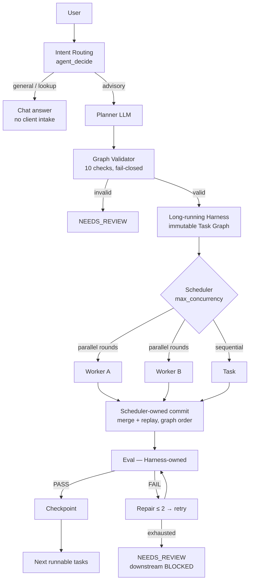

# insurance-agent

> 🌐 Language: 🇺🇸 English · 🇨🇳 [中文版](README.zh-CN.md)

**A long-running multi-agent runtime that plans, executes, evaluates, repairs, replans and supervises agent workflows.**

It combines a validated Planner, specialist agents, A2A communication, bounded
parallel execution, dynamic replanning, fail-closed evaluation,
checkpoint/resume, HITL approval and HOTL supervision. Insurance is the
first domain adapter, not the runtime itself.

The interesting part of this repository is not the insurance chatbot — it is the
execution system underneath: a state-driven, eval-gated, observable, resumable,
bounded-parallel Agent runtime built around a strict separation between
*planning*, *execution*, *quality* and *durable truth*.

```text
Insurance Agent            → the demonstration workload
Agent Runtime / Harness    → the engineering contribution
```

---

## What is this?

A single-process Agent runtime that turns a user request into a **validated
Task Graph**, executes it on a **long-running Harness** with **specialist
Agents**, gates every result behind a **deterministic Eval** with bounded
**Repair**, and persists everything as **Artifacts with provenance and
lineage** — sequentially by default, or as a **bounded parallel DAG** when
`max_concurrency > 1`. A FastAPI + React chat UI observes and drives it.

## Why is it interesting?

Most LLM demos optimize the prompt loop. This repository optimizes the
**execution engineering around the LLM**:

| Problem | This repository's answer |
| --- | --- |
| LLM output cannot be trusted | Untrusted Planner output → strict Graph Validator (fail-closed) |
| Agent self-grading | Agents never decide PASS — the Harness owns Eval + Repair |
| Long runs die mid-way | Disk-based checkpoints; resume in a NEW process; `RUNNING → PENDING` recovery |
| Parallel agents corrupt state | Workers execute on isolated CaseState copies; only the scheduler commits |
| Nobody knows why a result exists | Artifact registry with lineage, fingerprints, provenance |
| A2A turns into an actor soup | MessageBus is coordination only — it can never schedule, create tasks, or bypass deps |

## What can it do?

- Intent-routed chat (`GENERAL_KNOWLEDGE / GENERAL_GUIDANCE / CLIENT_ADVISORY / PRODUCT_LOOKUP / TASK_EXECUTION`)
- LLM Planner → strict JSON Task Graph → 10-check Graph Validator (cycle detection, artifact & eval contracts)
- Long-running Harness: projects, task lifecycle, dependency barriers, per-terminal checkpoints
- **Bounded parallel DAG scheduling** (`max_concurrency`, default 1 = unchanged sequential mode)
- **Harness-controlled dynamic replanning** (bounded budget, deterministic triggers, immutable graph revisions, validator-gated)
- **Human-in-the-loop approval gateway** (deterministic policy, fail-closed state machine, crash-safe pause/resume)
- **Human-on-the-loop control plane** (deterministic monitor + signals, risk levels, audited idempotent supervisor commands, safe-barrier pause/resume)
- 4 specialist Agents with a deterministic task→agent map, scoped tools, and permission validation
- Agent-to-Agent communication via a persistent, policy-enforced MessageBus with ACK-after-PASS handoffs
- Deterministic Eval (schema / required fields / contamination / provenance / cross-artifact / invariants) + repair ≤ 2
- Artifact registry: sequential IDs, lineage to client facts, fingerprint freeze verification
- Local RAG knowledge search with fail-closed evidence provenance
- Demo product catalog (explicitly `is_demo`) backing candidate filtering and recommendation
- Web UI (chat + developer console) with a live SSE event stream and artifact inspector
- Resume/recovery across processes; 52-suite regression runner; 33-case agent benchmark + golden cases
- **Deterministic runtime benchmark** (11 cases, 18 failure-injection scenarios, false-pass count 0) and **one-command demos**

## How does it work?



The one-line version of the architecture:

```text
Planner = WHAT · Agent = WHO/HOW · Skill = domain capability · Tool = capability interface
Harness = WHEN/reliability · Eval = quality · Artifact = durable truth · Message = coordination
```

Full details: [docs/architecture/overview.md](docs/architecture/overview.md).

## How do I run it?

**Environment:** Python 3.11+, repository root as the working directory, no
install step for the core loop (PyYAML, jsonschema; plus fastapi/uvicorn for
the server and an OpenAI-compatible SDK for agent mode). The React UI needs
Node/npm.

```bash
# 1. deterministic Quick Start — no LLM key, no network, no console-encoding
#    requirements. Runs the REAL runtime (Planner → Harness → 4 agents →
#    Eval → report) and prints a status-only transcript + run summary.
python -m demos.demo_basic

# 2. more deterministic demos (also offline, also real runtime)
python -m demos.demo_four_agent         # golden 4-agent parallel run
python -m demos.demo_replan             # failure → controlled replanning
python -m demos.demo_hitl               # human approval gate
python -m demos.demo_hotl               # supervisor pause/resume
python -m evals.benchmark.runner        # 11 deterministic benchmark cases

# 3. web app (optional)
python -m runtime.server                 # FastAPI + SSE on http://127.0.0.1:8000
cd web && npm install && npm run dev     # React UI on http://localhost:5173 (2nd terminal)

# 4. optional real-LLM smoke — requires a configured provider AND network;
#    fails closed on outage, never silently falls back (see .env.example)
python -m runtime.agent.smoke_test
```

Without `.env` the chat runs in **demo/deterministic mode**; with a key it
runs **agent mode** through the real LLM tool-calling loop
(OpenAI-compatible endpoint; GLM works through its OpenAI-compatible base URL).
Never commit real keys — `.env` is git-ignored.

## How do I test it?

```bash
pytest tests/runtime -q                  # the pytest-collectible runtime suite
python tmp/run_regression.py             # all 52 standalone suites (use PYTHONIOENCODING=utf-8 on cp936 consoles)
python evals/agent-benchmark/run_agent_benchmark.py    # 33-case agent benchmark
python evals/agent-benchmark/run_golden_cases.py       # golden-case regression
```

Test strategy and current known infra issues:
[docs/development/testing.md](docs/development/testing.md).

## How do I run the demos & the benchmark?

The fastest full experience (6 acts, ~1 minute): `python -m demos.demo_portfolio`

```bash
python -m demos.demo_basic         # happy path (4 agents → report)
python -m demos.demo_parallel      # bounded-parallel DAG
python -m demos.demo_replan        # failure → controlled replanning
python -m demos.demo_hitl          # human approval gate (approve & resume)
python -m demos.demo_hotl          # supervisor pause/resume
python -m demos.demo_four_agent    # the golden four-agent run

python -m evals.benchmark.runner   # 11 deterministic cases + hard gates
```

All demo output is real runtime state (events/artifacts/checkpoints) —
never chain-of-thought. Full results:
[docs/benchmark-report.md](docs/benchmark-report.md); 5-minute interview
walkthrough: [docs/portfolio-demo.md](docs/portfolio-demo.md).

## Where is the architecture?

| Topic | Document |
| --- | --- |
| Big picture, boundaries, phase history | [docs/architecture/overview.md](docs/architecture/overview.md) |
| Planner & graph validation | [docs/architecture/planner.md](docs/architecture/planner.md) |
| Harness, task states, recovery, failure model | [docs/architecture/harness.md](docs/architecture/harness.md) |
| Bounded parallel DAG scheduler | [docs/architecture/parallel-scheduler.md](docs/architecture/parallel-scheduler.md) |
| Dynamic replanning (Phase 8 V0.1) | [docs/architecture/dynamic-replanning.md](docs/architecture/dynamic-replanning.md) |
| Human-in-the-loop approval (Phase 9 V0.1) | [docs/architecture/human-in-the-loop.md](docs/architecture/human-in-the-loop.md) |
| Human-on-the-loop control plane (Phase 10 V0.1) | [docs/architecture/human-on-the-loop.md](docs/architecture/human-on-the-loop.md) |
| Specialist agents, executor, tools | [docs/architecture/agents.md](docs/architecture/agents.md) |
| A2A communication & handoffs | [docs/architecture/a2a.md](docs/architecture/a2a.md) |
| Eval & repair boundary | [docs/architecture/eval.md](docs/architecture/eval.md) |
| Artifacts, lineage, provenance | [docs/architecture/artifacts-and-provenance.md](docs/architecture/artifacts-and-provenance.md) |
| Insurance domain, catalog, knowledge | [docs/architecture/insurance-domain.md](docs/architecture/insurance-domain.md) |
| Key decisions | [docs/adr/](docs/adr/) (7 ADRs, EN + zh-CN) |
| Future work (not implemented) | [docs/roadmap.md](docs/roadmap.md) |
| Benchmark & failure injection | [docs/benchmark-report.md](docs/benchmark-report.md) |
| Generalization (domain vs runtime) | [docs/generalization.md](docs/generalization.md) |
| Interview demo script | [docs/demo-script.md](docs/demo-script.md) · [portfolio-demo.md](docs/portfolio-demo.md) |
| Portfolio positioning (2-min read) | [docs/portfolio.md](docs/portfolio.md) |
| Architecture diagrams | [docs/architecture.md](docs/architecture.md) · [runtime trace](docs/runtime-trace.md) |

## What this is NOT

- Not a distributed Agent platform — single process, thread-based bounded parallelism
- Not a production insurance recommendation system — demo catalog (`is_demo`), local demo knowledge corpus
- Not a live insurer product database
- Not an unrestricted autonomous Agent — every boundary is validated, eval-gated, fail-closed
- Not a Raft / queue / Kubernetes-grade scheduler

See [overview — scope & limitations](docs/architecture/overview.md#9-what-this-project-is-not).

## Repository layout

```text
runtime/            the Agent runtime (agent loop, planner, harness, agents, state, eval, server)
.trae/skills/       9 self-contained insurance Skills (SKILL.md + contract + evals + entrypoints)
contracts/          canonical JSON Schemas for every artifact
adapters/           native dialogue format → canonical artifact adapters
knowledge/          RAG engine + shared Evidence Provider (fail-closed provenance)
catalog/            demo product catalog (versioned, effective-dated, is_demo)
tests/              runtime suite (pytest) + standalone script suites
evals/              system-level benchmark + golden cases (skill-level evals live in each skill)
web/                React/Vite chat UI (SSE event stream, developer console)
docs/               architecture, ADRs, development guides, demo scripts
```

## Phase history (engineering evolution)

| Phase | Delivered |
| --- | --- |
| V2 Steps 0–4 | Contracts, core insurance Skills, orchestrator, deterministic Eval + Repair, checkpoints |
| 2.5 / 2.6 | Runtime observability (event stream + SSE), chat-first Agent, real LLM agent mode |
| 3 | Long-running Harness (projects, task lifecycle, resume across processes) |
| 4 | Planner + Task Registry + Graph Validator (fail-closed) |
| 5 | Multi-agent: specialist executors, deterministic assignment, permission validation |
| 6 | A2A communication: MessageBus, handoff lifecycle, communication policy |
| 7 | Bounded parallel DAG scheduler (isolated workers, scheduler-owned commit, recovery) + housekeeping freeze |
| 8 | Dynamic replanning V0.1 (deterministic triggers, safe barriers, immutable graph revisions, bounded budget) |
| 9 | Human-in-the-loop approval gateway V0.1 (deterministic policy, fail-closed approvals, Harness-owned resume) |
| 10 | Human-on-the-loop control plane V0.1 (deterministic monitor, intervention policy, audited supervisor commands) |

Each layer froze before the next began; `max_concurrency=1` still runs the
Phase 6 sequential path byte-for-byte.

---

License / authors: see repository metadata. This is an engineering portfolio
project — the docs deliberately avoid overstating scope.
