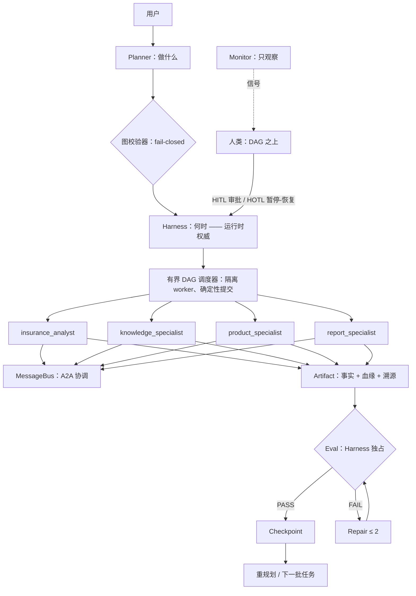

# 长运行多 Agent 运行时

> 语言：中文 | [English](README.md)

**一个状态驱动的运行时：规划、执行、评估、修复、重规划并监督长运行
Agent 工作流。**
保险是第一个领域适配器 —— 同一运行时上还运行着软件工程工作流，以证明
运行时本身是通用的。

```text
传统 LLM 应用：   Prompt -> LLM -> 回答

本运行时：        请求 -> Planner -> 任务图 -> 长运行 Harness
                 -> 专家 Agent -> Artifact -> Eval -> Repair
                 -> 重规划 -> 人工控制 -> 可恢复的结果
```

```text
保险 Agent        -> 示范负载
Agent Runtime     -> 工程贡献
```

**我的贡献** —— 架构与语义：Planner/校验设计、任务生命周期、调度器
语义、Agent/Skill/Tool 边界、评估策略、Repair/Replan 语义、HITL/HOTL
控制设计、Checkpoint/恢复、Benchmark 与红队设计、领域适配器泛化、
作品化。（AI 编码工具仅作为开发工具；系统设计与证明才是核心。）

---

## 为什么做这个项目

单次 LLM 调用无法交付**工作成果**：真正的任务是多步骤、长运行、多专家
协作、会局部失败、需要证据、且需要人能在不阻塞流程的前提下介入。本
项目构建的是缺失的执行层 —— Agent *运行时*，而不是又一个 Prompt。

## 5 分钟 Demo

```bash
python -m demos.demo_portfolio
```

六幕、全部真实执行：问题 -> Planner -> 4 Agent 并行运行 -> 来自持久
事件日志的运行时 Trace -> 失败/重规划/HITL/HOTL 恢复 -> 带溯源的交付
成果 -> 第二领域切换。[解说脚本（5 & 10 分钟）](docs/portfolio/demo-script.md)。

## 架构



权限边界：**Harness** = 运行时权威（唯一状态写者）；**Planner** =
规划权威（不可信 -> 校验）；**Agent** = 执行/请求（绝不自评 PASS）；
**Eval** = 质量门（绝不放进工具内）；**Artifact** = 事实来源；
**Monitor** = 只观察；**人类** = 经控制面审批/介入，绝不直接改状态。

## 多 Agent 协作

4 个专家 Agent，确定性分配、受控工具集（分析 Agent 物理上无法点名
产品）；协作只经校验过的持久 A2A MessageBus（PASS 后才 ACK）；并行
分支运行在有界 DAG 调度器上、worker 隔离 —— 调度器是唯一状态写者，
并发下结果仍然确定。

## 评估与可靠性

每个 Artifact 都要通过 Harness 独占的确定性评估（schema、必填字段、
产品泄漏污染、溯源、跨 Artifact 引用、目录不变量），有界 Repair
（≤ 2），然后 fail-closed NEEDS_REVIEW。失败绝不伪造成功：空知识不
存储编造证据；LLM 断网 fail closed；对抗性 false-pass 套件证明坏输入
全部被拒（计数 0）。

## 人工控制

- **HITL** —— 人作为决策门：高影响图变更停在 WAITING_HUMAN；批准/
  拒绝；拒绝即 fail closed。
- **HOTL** —— 人作为 DAG 之上的监督者：确定性 monitor 产生风险信号；
  策略决定 NOTIFY/PAUSE；暂停只在安全屏障生效（绝不中途杀死提交）；
  命令可审计、幂等。

## 保险案例（第一个领域适配器）

一个现实（虚构）家庭案例 —— 30 岁已婚、0 岁孩子、年收入 50 万、计划
200 万房贷 —— 跑完整流水线：事实 -> 需求 -> 风险 -> 缺口 -> 方案 ->
知识 -> 候选 -> 报告，报告可回溯到客户事实。
`python -m demos.demo_insurance` · [运行时 Trace](docs/runtime-trace.md)

## 泛化：软件工程（第二领域）

同一套 Planner/Harness/调度器/评估/Artifact 栈；约 40 行声明式领域
适配器（任务目录、Agent、workflow、eval 规则）；零运行时 fork。
5/5 任务、5/5 评估、血缘校验、COMPLETED。
`python -m demos.demo_generalization` · [审计](docs/generalization.zh-CN.md)

## Benchmark

```bash
python -m evals.benchmark.runner     # 11/11 用例，硬门全 0
```

11 个确定性场景用例（正常路径、信息缺失、知识/产品失败、repair 耗尽、
重规划、并行一致性、HITL、HOTL 通知/暂停、4-Agent 金样本）+ 18 行
故障注入矩阵 + 对抗性 false-pass 测试 + 篡改测试（破坏运行时会让
benchmark 失败）。[报告](docs/benchmark-report.zh-CN.md)

## 设计决策

13 条取舍记录（为什么不是一个大脑；为什么 eval 不放工具里；为什么
调度器是本地的；为什么 HITL 与 HOTL 是两回事；为什么不用 Redis……）：
[design-decisions.md](docs/portfolio/design-decisions.md) ·
7 篇 ADR 见 [docs/adr/](docs/adr/)

## 限制（诚实声明）

经验证的**作品原型** —— 单进程、基于线程；JSON 文件持久化（刻意不用
Redis/Postgres/K8s）；演示产品目录（非真实保险数据、明确标注）；
真实 LLM smoke 依赖外部 API、断网 fail closed；不构成生产保险建议。

## 快速开始

```bash
# 1. 确定性 Quick Start —— 无需 LLM key、无需网络、不受编码影响
python -m demos.demo_basic

# 2. 更多 demo（离线、真实运行时）
python -m demos.demo_four_agent         # 四 Agent 并行金样本
python -m demos.demo_replan             # 失败 -> 受控重规划
python -m demos.demo_hitl               # 人工审批门
python -m demos.demo_hotl               # 监督者暂停/恢复
python -m demos.demo_portfolio          # 六幕完整演示
python -m evals.benchmark.runner        # 11 个确定性 benchmark 用例

# 3. Web 应用（可选）
python -m runtime.server                # FastAPI + SSE, 127.0.0.1:8000
cd web && npm install && npm run dev    # React UI, localhost:5173

# 4. 可选真实 LLM smoke（需 provider + 网络；断网 fail closed）
python -m runtime.agent.smoke_test
```

## 测试

```bash
pytest tests/runtime tests/portfolio -q   # 326 项测试
PYTHONIOENCODING=utf-8 python tmp/run_regression.py
```

## 项目结构

```text
runtime/      Agent 运行时（planner、harness、agents、A2A、
              审批、控制面、state、eval、可观测性、server）
.trae/skills/ 保险 Skill（9 个，自包含：契约 + evals）
contracts/    Artifact JSON Schema      catalog/  演示产品目录
knowledge/    RAG + Evidence Provider   demos/    一条命令的 demo
evals/benchmark/  确定性 benchmark + 故障注入
tests/        runtime（pytest）+ portfolio 验收（反作弊）
docs/         架构 | portfolio | ADR | benchmark 报告
```

## Portfolio / 面试

[项目总览](docs/portfolio/project-overview.md) |
[Agent 开发视角](docs/portfolio/agent-developer.md) |
[Agent PM 视角](docs/portfolio/agent-pm.md) |
[架构面试指南](docs/portfolio/architecture-interview.md) |
[面试 Q&A（30 题）](docs/portfolio/interview-qa.md) |
[简历 bullet](docs/portfolio/resume-bullets.md) |
[已验证数字](docs/portfolio/project-results.md) |
[Demo 脚本](docs/portfolio/demo-script.md)

## 开发历史

以 12 个经审计的阶段构建并冻结（确定性流水线 -> 可观测 -> harness ->
planner -> 多 Agent -> A2A -> 有界并行调度器 -> 动态重规划 -> HITL ->
HOTL -> benchmark/红队 -> portfolio），每个阶段各自带回套件至今仍通过。
已打 **v0.1.0** 标签作为 Portfolio 稳定版本。详见
[阶段史](docs/architecture/overview.zh-CN.md)
