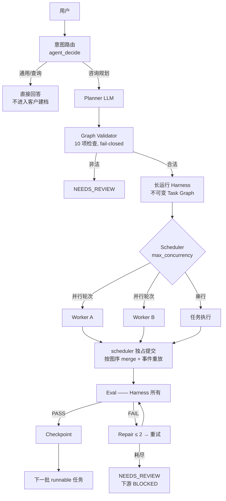

# insurance-agent

> 🌐 语言：🇨🇳 中文 · 🇺🇸 [English](README.md)

**一个 Agent Runtime / Harness 工程项目，以保险分析作为示范负载。**

这个仓库有意思的部分不是保险对话机器人，而是其下方的执行系统：一个
状态驱动、Eval 把关、可观测、可恢复、有界并行的 Agent 运行时，核心是
*规划*、*执行*、*质量* 与 *持久事实* 的严格分离。

```text
Insurance Agent            → 示范负载（保险）
Agent Runtime / Harness    → 工程贡献（运行时）
```

---

## 这是什么？

一个单进程 Agent 运行时：把用户请求变成**经过校验的 Task Graph**，在
**长运行 Harness** 上由**专家 Agent** 执行，每个结果都要通过**确定性
Eval** 与有界 **Repair** 的门禁，一切产出都以**带溯源与血缘的
Artifact** 持久化——默认串行，`max_concurrency > 1` 时按**有界并行
DAG** 调度。FastAPI + React 聊天 UI 负责观察与驱动。

## 为什么值得看？

多数 LLM 演示优化的是 prompt 循环；本仓库优化的是 **LLM 周边的执行
工程**：

| 问题 | 本仓库的回答 |
| --- | --- |
| LLM 输出不可信 | Planner 输出视为不可信 → 严格 Graph Validator（fail-closed） |
| Agent 自评自夸 | Agent 永远不能判定 PASS —— Eval 与 Repair 归 Harness 所有 |
| 长任务中途死亡 | 磁盘 checkpoint；新进程可恢复；RUNNING → PENDING 恢复语义 |
| 并行 Agent 写坏状态 | Worker 只在隔离的 CaseState 副本上执行；只有 scheduler 提交 |
| 说不清结果从哪来 | Artifact 注册表：血缘、指纹、溯源一查到底 |
| A2A 沦为失控 actor | MessageBus 只做协调——不能调度、不能建任务、不能绕过依赖 |

## 能做什么？

- 意图路由聊天（`GENERAL_KNOWLEDGE / GENERAL_GUIDANCE / CLIENT_ADVISORY / PRODUCT_LOOKUP / TASK_EXECUTION`）
- LLM Planner → 严格 JSON Task Graph → 10 项检查的 Graph Validator（环检测、artifact/eval 契约）
- 长运行 Harness：project、任务生命周期、依赖屏障、每个终态 checkpoint
- **有界并行 DAG 调度**（`max_concurrency`，默认 1 = 保持原串行路径）
- **Harness 控制的动态重规划**（有界预算、确定性触发、不可变图修订、校验器把关）
- **人工审批网关**（确定性策略、fail-closed 状态机、崩溃安全的暂停/恢复）
- **Human-on-the-loop 控制面**（确定性 monitor + 信号、风险级别、可审计幂等的监督者命令、安全屏障暂停/恢复）
- 4 个专家 Agent：确定性 task→agent 分配、受控工具集、权限校验
- 基于 MessageBus 的 Agent 间通信：持久化、策略受限、PASS 后才 ACK 的 handoff
- 确定性 Eval（schema / 必填字段 / 污染 / 溯源 / 跨 artifact / 不变量）+ 最多 2 次 Repair
- Artifact 注册表：顺序 ID、回溯到客户事实的血缘、指纹冻结校验
- 本地 RAG 知识检索，证据溯源 fail-closed
- 演示产品目录（显式 `is_demo`）支撑候选筛选与推荐
- Web UI（聊天 + 开发者控制台）：SSE 实时事件流 + artifact 检查器
- 跨进程恢复；52 套回归 runner；33 例 agent benchmark + golden cases

## 怎么运作？



一行版架构：

```text
Planner = 做什么 · Agent = 谁来做/怎么做 · Skill = 领域能力 · Tool = 能力接口
Harness = 何时/可靠性 · Eval = 质量 · Artifact = 持久事实 · Message = 协调信号
```

完整说明：[docs/architecture/overview.zh-CN.md](docs/architecture/overview.zh-CN.md)。

## 怎么跑？

**环境**：Python 3.11+，仓库根目录为工作目录；核心链路无需安装步骤
（依赖 PyYAML、jsonschema；server 需要 fastapi/uvicorn，agent 模式需要
OpenAI 兼容 SDK）。React UI 需要 Node/npm。

```bash
# 1. 配置（可选 —— 无 LLM key 时为 demo/确定性模式）
cp .env.example .env                     # LLM_PROVIDER / LLM_MODEL / LLM_API_KEY / LLM_BASE_URL
python -m runtime.agent.smoke_test       # 验证 provider

# 2. 启动 Web 应用
python -m runtime.server                 # FastAPI + SSE, http://127.0.0.1:8000
cd web && npm install && npm run dev     # React UI, http://localhost:5173（第二个终端）

# 3. 不起 server 跑确定性流水线
python demo.py demo-a                    # 完整链路 → 有据推荐
python demo.py demo-b                    # 空知识库 → NEEDS_REVIEW（fail-closed）
```

## 怎么测？

```bash
pytest tests/runtime -q                  # pytest 可收集的 runtime 套件
python tmp/run_regression.py             # 全部 52 个独立套件（cp936 控制台加 PYTHONIOENCODING=utf-8）
python evals/agent-benchmark/run_agent_benchmark.py    # 33 例 agent benchmark
python evals/agent-benchmark/run_golden_cases.py       # golden 回归
```

测试策略与已知基础设施问题：[docs/development/testing.zh-CN.md](docs/development/testing.zh-CN.md)。

## 架构文档在哪？

| 主题 | 文档 |
| --- | --- |
| 总览、边界、阶段史 | [overview.zh-CN.md](docs/architecture/overview.zh-CN.md) |
| Planner 与图校验 | [planner.zh-CN.md](docs/architecture/planner.zh-CN.md) |
| Harness、任务状态、恢复、失败模型 | [harness.zh-CN.md](docs/architecture/harness.zh-CN.md) |
| 有界并行 DAG 调度器 | [parallel-scheduler.zh-CN.md](docs/architecture/parallel-scheduler.zh-CN.md) |
| 动态重规划（Phase 8 V0.1） | [dynamic-replanning.zh-CN.md](docs/architecture/dynamic-replanning.zh-CN.md) |
| 人工审批（Phase 9 V0.1） | [human-in-the-loop.zh-CN.md](docs/architecture/human-in-the-loop.zh-CN.md) |
| Human-on-the-loop 控制面（Phase 10 V0.1） | [human-on-the-loop.zh-CN.md](docs/architecture/human-on-the-loop.zh-CN.md) |
| 专家 Agent、执行器、工具 | [agents.zh-CN.md](docs/architecture/agents.zh-CN.md) |
| A2A 通信与 handoff | [a2a.zh-CN.md](docs/architecture/a2a.zh-CN.md) |
| Eval 与 Repair 边界 | [eval.zh-CN.md](docs/architecture/eval.zh-CN.md) |
| Artifact、血缘、溯源 | [artifacts-and-provenance.zh-CN.md](docs/architecture/artifacts-and-provenance.zh-CN.md) |
| 保险领域、目录、知识 | [insurance-domain.zh-CN.md](docs/architecture/insurance-domain.zh-CN.md) |
| 关键决策 | [docs/adr/](docs/adr/)（7 篇 ADR，中英双语） |
| 未来方向（未实现） | [docs/roadmap.zh-CN.md](docs/roadmap.zh-CN.md) |

## 这不是什么

- 不是分布式 Agent 平台 —— 单进程、基于线程的有界并行
- 不是生产级保险推荐系统 —— 演示目录（`is_demo`）、本地演示知识库
- 不是真实保险产品数据库
- 不是不受约束的自主 Agent —— 每个边界都有校验、Eval 门禁、fail-closed
- 不是 Raft / 消息队列 / Kubernetes 级调度器

见 [overview — 范围与限制](docs/architecture/overview.zh-CN.md#9-这个项目不是什么)。

## 仓库结构

```text
runtime/            Agent 运行时（agent 循环、planner、harness、agents、state、eval、server）
.trae/skills/       9 个自包含保险 Skill（SKILL.md + 契约 + evals + 入口脚本）
contracts/          每个 artifact 的规范 JSON Schema
adapters/           对话原生格式 → 规范 artifact 的适配器
knowledge/          RAG 引擎 + 共享 Evidence Provider（溯源 fail-closed）
catalog/            演示产品目录（带版本、生效日期、is_demo）
tests/              runtime 套件（pytest）+ 独立脚本套件
evals/              系统级 benchmark + golden（Skill 级 eval 在各 Skill 内）
web/                React/Vite 聊天 UI（SSE 事件流、开发者控制台）
docs/               架构、ADR、开发指南、演示脚本
```

## 阶段史（工程演进）

| 阶段 | 交付 |
| --- | --- |
| V2 Steps 0–4 | 契约、核心保险 Skill、orchestrator、确定性 Eval + Repair、checkpoint |
| 2.5 / 2.6 | 运行时可观测（事件流 + SSE）、聊天优先 Agent、真实 LLM agent 模式 |
| 3 | 长运行 Harness（project、任务生命周期、跨进程恢复） |
| 4 | Planner + Task Registry + Graph Validator（fail-closed） |
| 5 | 多 Agent：专家执行器、确定性分配、权限校验 |
| 6 | A2A 通信：MessageBus、handoff 生命周期、通信策略 |
| 7 | 有界并行 DAG 调度器（隔离 worker、scheduler 独占提交、恢复）+ housekeeping 冻结 |
| 8 | 动态重规划 V0.1（确定性触发、安全屏障、不可变图修订、有界预算） |
| 9 | 人工审批网关 V0.1（确定性策略、fail-closed 审批、Harness 独占恢复） |
| 10 | Human-on-the-loop 控制面 V0.1（确定性 monitor、介入策略、可审计的监督者命令） |

每层冻结后才进入下一层；`max_concurrency=1` 至今逐字节保持 Phase 6
串行路径。

---

这是一个工程项目组合（portfolio）：文档刻意不夸大范围。
