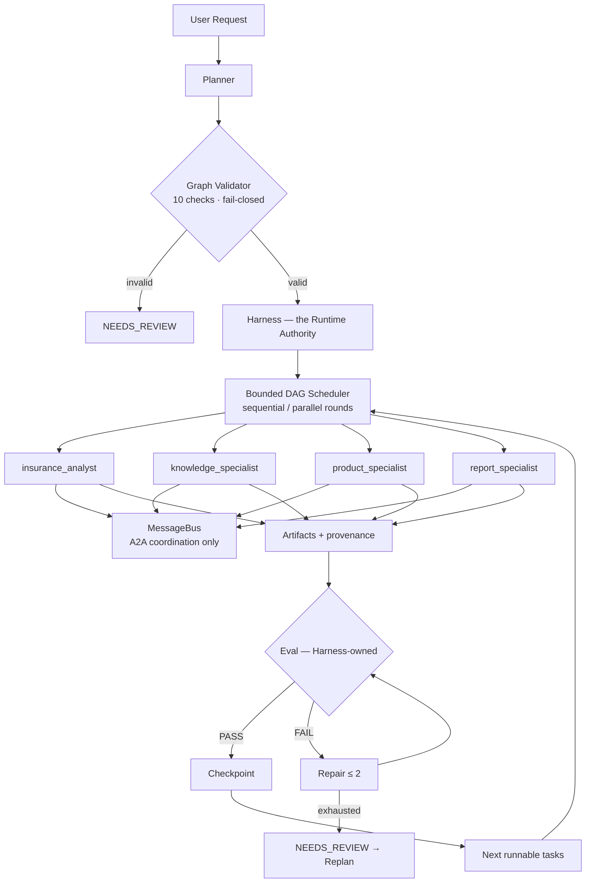
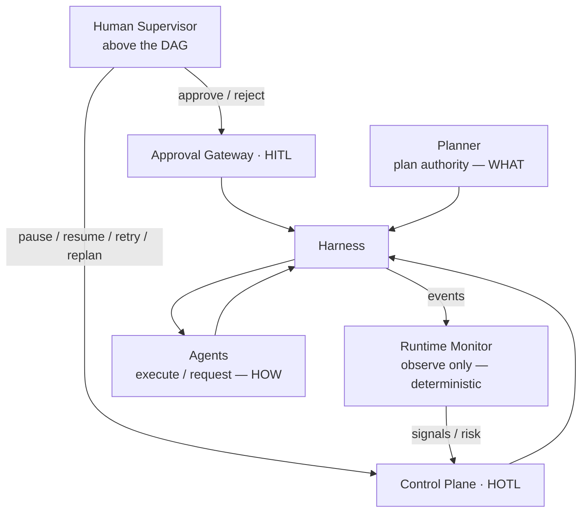

# Architecture

> 🌐 Language: 🇺🇸 English (this file is the Phase-12 entry-point diagram set;
> deep-dives live in [architecture/](architecture/overview.md))

## System architecture



## Control architecture — humans are NOT nodes in the DAG



```text
Harness  = Runtime Authority (the only scheduler / state mutator)
Planner  = Plan Authority (untrusted output → validated graphs)
Monitor  = Observe Only (deterministic signals, no commands)
Agent    = Execute / Request (never PASS, never control)
Human    = Approve / Intervene (through the control plane, never direct)
```

## Why not just an LLM call?

```text
A normal LLM app:      Request → LLM → Answer

This runtime:          Request → Planner → Task Graph → Multi-Agent
                       → Artifacts → Eval → Repair → Replanning
                       → Human Control → Recoverable Final Result
```

Generic runtime vs domain adapter: see [generalization.md](generalization.md).
The full phase-by-phase architecture lives in
[architecture/overview.md](architecture/overview.md).
