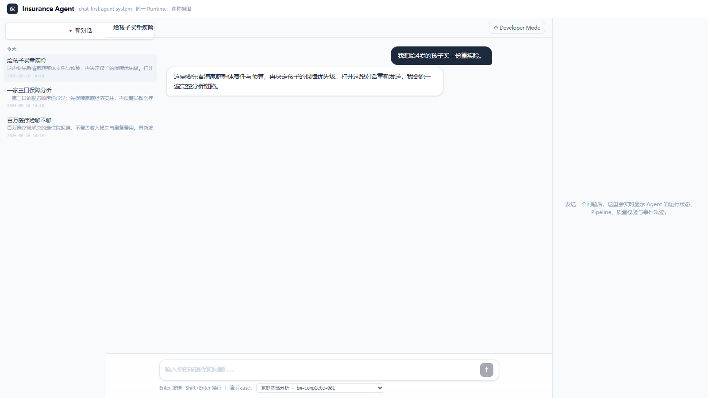
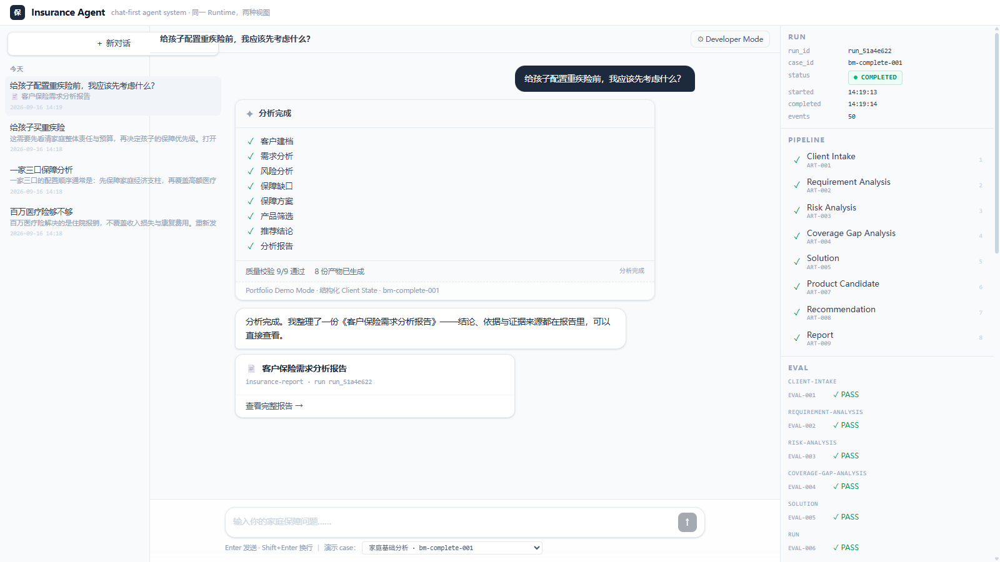
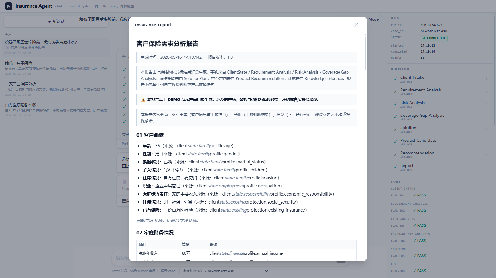
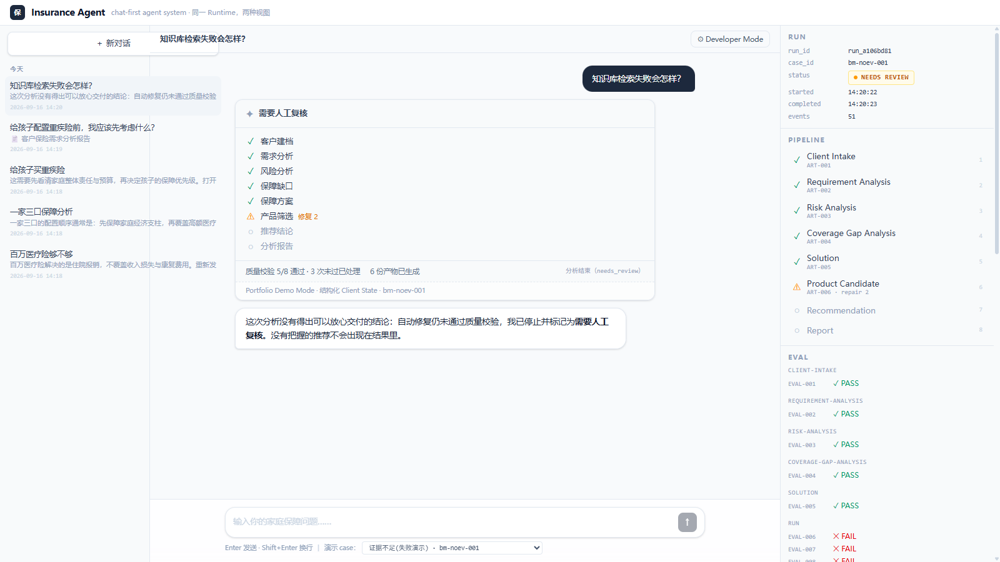
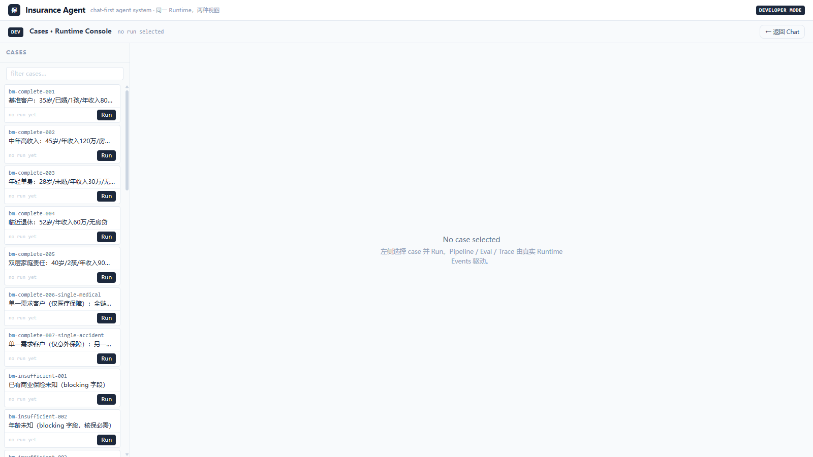

# Chat Demo — “我想给孩子配置重疾险” → 可观察的完整分析

用户看到 Chat；工程师看到 Runtime；底层是**同一个 Run、同一个 Event Stream、
同一套 Artifact 与 Provenance**。

```bash
python -m runtime.server                 # 终端 1：后端
cd web && npm run dev                    # 终端 2：UI → http://localhost:5173
```

## 演示脚本（~2 分钟）

1. **打开即聊天**：欢迎页 + 4 个演示问题（点击只填入输入框，不自动发送）。
   注意底部黄色披露：Portfolio Demo Mode · 结构化 Client State 上游。
   
2. **发送**「给孩子配置重疾险前，我应该先考虑什么？」→ 自动映射
   `bm-complete-001`（输入框旁可改）→ 唯一执行路径 `POST /api/runs`。
3. **Agent 正在工作**：对话中实时工作卡（✓/●/○ + 修复计数 + 最新动态），
   右侧 Inspector 的 RUN/PIPELINE/EVAL/TRACE 同步变化 —— 全部来自 SSE
   RuntimeEvents，无前端编造。
   
4. **完成**：助手结语 + 📄《客户保险需求分析报告》卡片 → **查看完整报告**
   弹窗渲染 runtime 自己产出的 Markdown（含表格与 DEMO 披露）。
    
5. **失败路径**：新对话发送「知识库检索失败会怎样？」→ 映射 `bm-noev-001`
   （空知识库）→ Eval FAIL → 修复 1/2 → 仍失败 → ⚠ 需要人工复核，下游 stage
   保持 ○，助手明确拒绝交付无把握的推荐。
   
6. **工程师视角**：右上 `⚙ Developer Mode` → Phase 2 Cases/Runtime Console
   原样可用（33 cases、事件轨迹、Artifact Inspector），`← 返回 Chat`。
   
7. **刷新页面**：时间线经 `after_event_id` 重放重建，无重复无丢失。

## 一图总结

```text
USER “给孩子配置重疾险” → Chatbot → Agent 正在工作（✓需求 ✓风险 ●缺口…）
  → Eval ✓ → 📄 报告 → 查看完整报告
右侧：RUN ●COMPLETED · PIPELINE ✓×8 · EVAL ✓ · TRACE 50 events
```

Correctness · Observability · Provenance · Failure handling —— 而不是功能数量。
