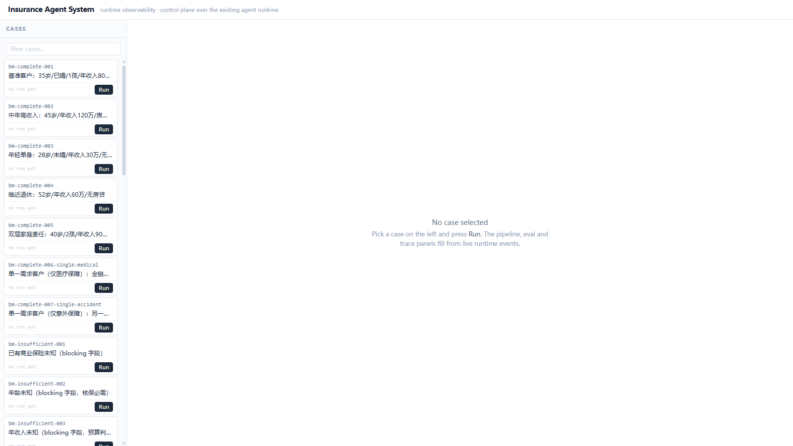
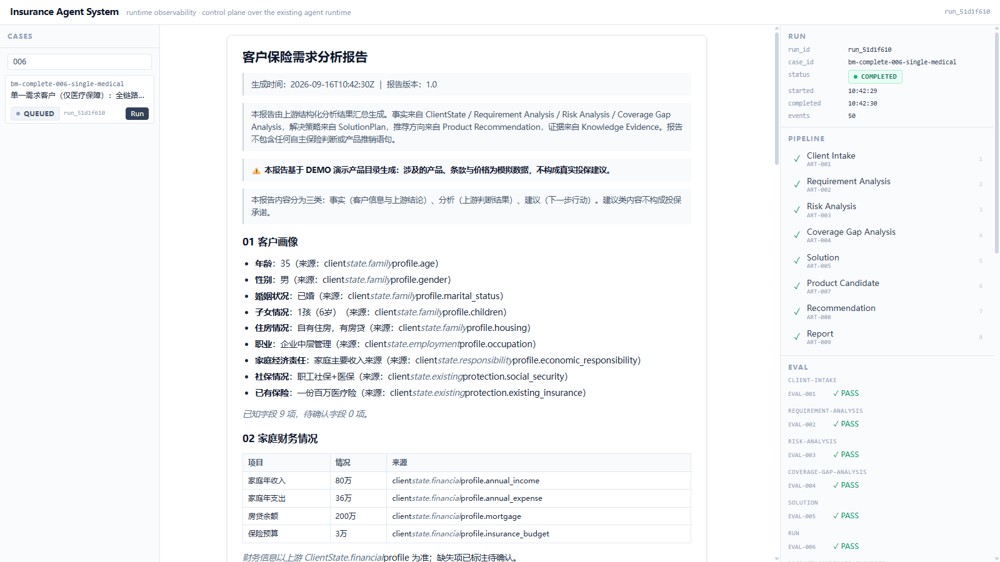
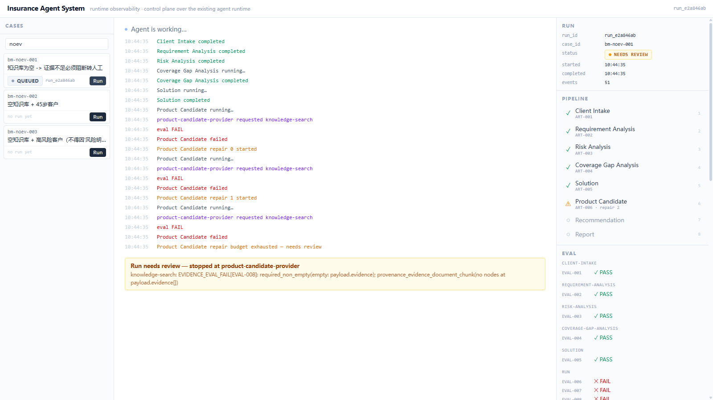
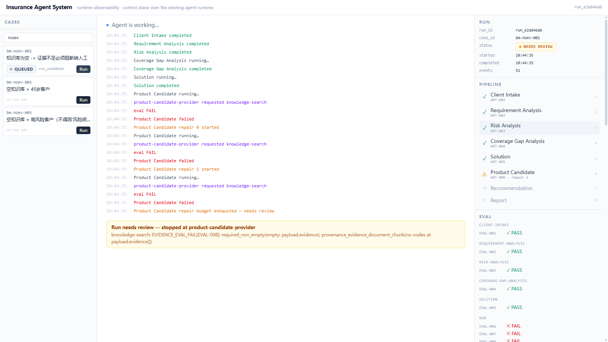

# Web UI Demo — Case → Run → Pipeline → Eval → Provenance → Report

The fastest way to see what this portfolio is about: **a reliable agent runtime made
observable**. Not a chatbot — an execution you can audit.

## Start it

```bash
# terminal 1 — the agent runtime + event stream API
python -m runtime.server            # 127.0.0.1:8000

# terminal 2 — the UI
cd web && npm install && npm run dev   # http://localhost:5173
```

## The 2-minute walkthrough

1. **Cases** (left): the benchmark catalog (33 cases from `evals/agent-benchmark`).
   Filter to `006` and press **Run** on `bm-complete-006-single-medical`.
2. The **Runtime Inspector** (right) comes alive: RUN goes QUEUED→RUNNING→COMPLETED,
   the PIPELINE fills stage by stage (○ pending → ● running → ✓ passed — straight
   from SSE runtime events), EVAL rows flip PASS, the TRACE timeline scrolls.
3. The middle panel shows live progress ("Agent is working…") and, once the report
   stage passes, the runtime's own rendered **客户保险需求分析报告** (client profile,
   finances table, risk exposure, coverage gaps, priorities, directions — with the
   DEMO-product disclosure).
4. Click any pipeline stage → **Artifact Inspector**: artifact_id, producer,
   created_at, the provenance chain (e.g. ART-001 client-profile → ART-002
   requirement → ART-003 risk-assessment), structured summary + raw JSON.
5. **Failure path**: filter `noev`, run `bm-noev-001` (empty knowledge base). Watch
   eval FAIL → repair attempts → `repair_exhausted` → the stage goes ⚠ NEEDS REVIEW,
   downstream stages stay ○, and the outcome card names the root cause
   (`EVIDENCE_EVAL_FAIL … required_non_empty`) — the agent refuses to push
   ungrounded recommendations downstream.
6. **Refresh the page mid- or post-run** — the timeline rebuilds from event history
   via `after_event_id`; nothing is lost or duplicated.
7. Press **Run** on a case that is already running → the runtime answers
   `409 case_already_running`; the UI offers **Open active run** instead of a duplicate.

## Screenshots

| | |
|---|---|
|  | Case catalog, empty state |
|  | Completed run: pipeline ✓, evals PASS, rendered report |
|  | Failure path: repair exhausted → NEEDS REVIEW, root cause visible |
|  | Artifact inspector with provenance chain |

## What you are actually looking at

```text
                Insurance Agent System
                         │
                    ┌────▼────┐
                    │   Run   │   ← POST /api/runs (the UI's only control action)
                    └────┬────┘
        ┌────────────────┼────────────────┐
     Pipeline           Eval          Provenance
        │                │                │
        ▼                ▼                ▼
   Stage 1 → 2 → …   PASS/FAIL/Repair   Artifact chain (registry lineage)
        │                │                │
        └────────────────┼────────────────┘
                    Final Report           ← the runtime's own artifact, rendered
```

Every pixel is backed by a runtime event or a runtime-produced artifact — the UI
contains no insurance logic of its own. P001 and the catalog are DEMO data.
