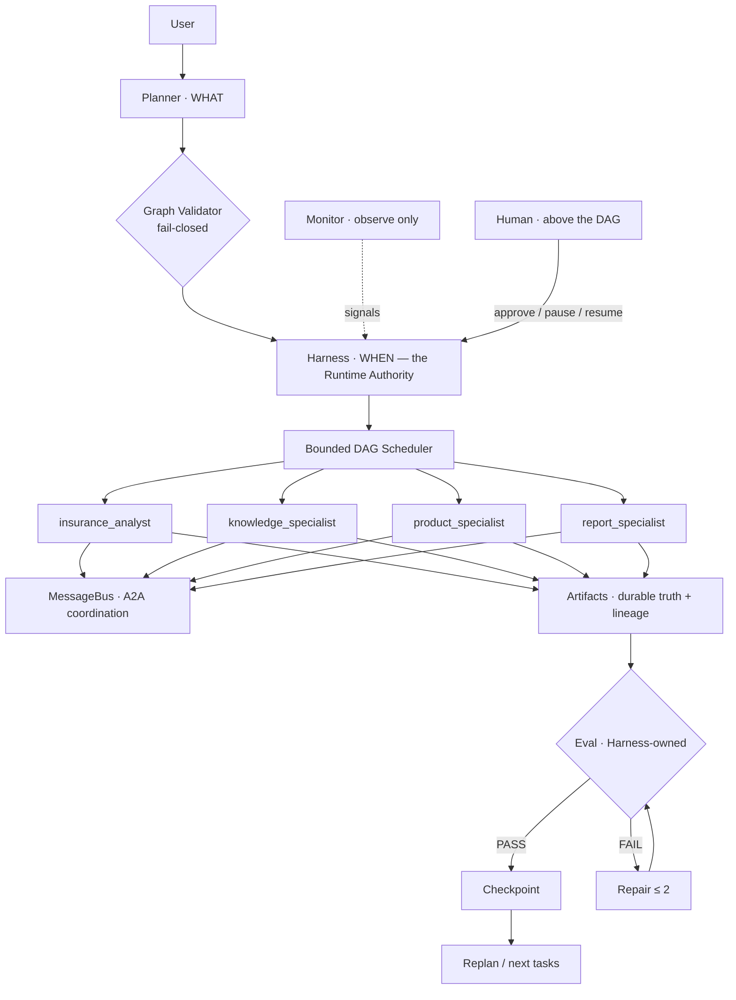

# Long-running Multi-Agent Runtime

> Hiring-manager 2-minute read. Deep dives:
> [agent-developer.md](agent-developer.md) · [agent-pm.md](agent-pm.md) ·
> [architecture-interview.md](architecture-interview.md) ·
> [project-results.md](project-results.md)

A state-driven runtime for planning, executing, evaluating, repairing,
replanning and supervising long-running agent workflows. **Insurance is the
first domain adapter**; a software-engineering workflow runs on the same
runtime to prove the runtime is generic.

## The problem

A traditional LLM application is `Prompt → LLM → Answer`. That shape cannot
deliver **work**: multi-step tasks that run long, need several specialists,
fail partially, require evidence, and need a human who can intervene
without becoming a bottleneck. This project builds the missing execution
layer — the agent *runtime*, not another prompt.

```text
This project:  Request → Planner → Task Graph → Long-running Harness
              → Specialist Agents → Artifacts → Eval → Repair
              → Replanning → Human Control → Recoverable Result
```

## Architecture in one diagram



## What makes it different

1. **Agents never grade themselves** — eval is a separate, deterministic,
   harness-owned gate (repair ≤ 2, then fail closed).
2. **Artifacts are the source of truth** — every result has lineage,
   fingerprints and provenance; messages are only coordination.
3. **Humans are not nodes in the DAG** — HITL approval gates for
   high-impact decisions; HOTL supervision (pause/resume/retry/replan)
   from above the workflow, at safe barriers.
4. **It recovers** — checkpoints, cross-process resume, idempotent
   commands, immutable graph revisions under replanning.
5. **It's proven, not claimed** — deterministic benchmark (11 cases),
   18 fault injections, adversarial false-pass suite (count 0), crash
   recovery, 3× determinism checks.

## Evidence (re-verified from the live repo)

```text
326 tests passing (314 runtime + 12 portfolio acceptance)
11/11 deterministic benchmark cases · 18/18 fault injections
false-pass count 0 · provenance errors 0 · duplicate executions 0
6 one-command demos · second domain demonstrated on the frozen runtime
```

## Demo

```bash
python -m demos.demo_portfolio        # the 6-act live demo (~4s)
```

## Generalization

Insurance → software engineering: same Planner/Harness/Scheduler/Eval/
Artifact stack, ~40-line declarative domain adapter, zero runtime fork
(`demos/demo_generalization.py`).

## Limitations (stated, not hidden)

Single-process, thread-based; JSON-file persistence (no Redis/Postgres by
design for this portfolio prototype); demo product catalog; real-LLM smoke
depends on external API availability and fails closed on outage. This is a
validated portfolio prototype, not a production system.
